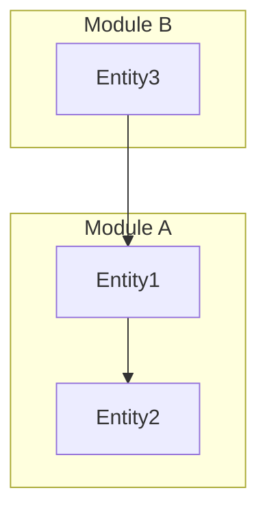

# Find Reference in the Codebase

Based on the `Instructions` below, take the `Variables` and follow the `Run` section to analyze the codebase. Then follow the `Report` section to export the results in the specified format.

## Variables

- **pattern**: `$1` (Regex or keyword to search)
- **prompt**: `$2` (Natural language description of what to find)
- **report_format**: `$3` (Output format: json, markdown, table, csv, html)
- **tools**: `$4` (Preferred search tools: rg, grep, glob, etc.)
- **depth**: `$5` (Context depth for analysis, e.g., "shallow", "deep")

## Variables Information

- **pattern**: e.g., `base_url|Baseurl`, `[A-Z][a-zA-Z0-9]+Model`, `Database|postgres|psql`.
- **prompt**: e.g., "find all references of base_url", "locate database connection logic".
- **report_format**: `markdown` triggers detailed descriptions and Mermaid diagrams.
- **tools**: Default is `rg` (ripgrep) for efficiency.

## Instructions

### 1. Search Logic
- **Pattern Extraction**: If `pattern` is missing, derive it from `prompt`. If both exist, use `pattern` as the primary filter and `prompt` for contextual refinement.
- **Execution**: Use `tools` to scan. Ignore build artifacts, `node_modules`, and `.git` directories.

### 2. Context Evaluation
- For every match, determine:
    - **Entity**: The specific function, class, method, variable, or constant name containing the match.
    - **Entity Type**: Whether it's a function, class, method, variable, constant, import, etc.
    - **Purpose**: What the code is doing in this specific instance.
    - **Relationship**: How this entity interacts with other parts of the codebase (callers/callees/imports/exports).

### 3. Export Logic
- **Standard Format**: `<file> : <line> : <function/class/variable> : <purpose>`
- **Markdown Enhancement**: If `report_format` is `markdown`:
    - Create a comprehensive structured document with detailed headers.
    - Include a **Mermaid.js** diagram (e.g., `graph TD` or `classDiagram`) visualizing the dependencies or flow between the discovered references.
    - Provide an exhaustive "Detailed Reference Analysis" section for EACH reference found.

## Run

1. **Initialize**: Parse `pattern` and `prompt`.
2. **Scan**: Execute the search tool across the codebase.
3. **Analyze**: Iterate through matches. For each, backtrack to find the enclosing scope (class/function definition).
4. **Synthesize**: Map the relationships between findings to prepare for diagramming.
5. **Generate**: Construct the final report based on `report_format`.

---

## Report

### Format: Standard (Log Style)
Return results as lines of:
```
<file_path> : L<line_number> : <function/class/variable> : <purpose>
```

### Format: Markdown (Detailed Report)

When `report_format` is `markdown`, generate a **comprehensive and detailed** report using the following structure:

---

# 📊 Codebase Reference Report: `{pattern}`

> Generated analysis for pattern: `{pattern}`
> Search prompt: "{prompt}"

---

## 📋 Quick Summary

| # | File | Line | Entity | Type | Brief Description |
|:-:|:-----|:----:|:-------|:-----|:------------------|
| 1 | `path/to/file.ext` | 42 | `entityName` | function | Short description... |
| 2 | ... | ... | ... | ... | ... |

---

## 🗺️ Architecture Visualization



---

## 📑 Detailed Reference Analysis

For **EACH** reference found, create an entry with the following structure:

---

### Reference #1

| Field | Value |
|:------|:------|
| **@file_path** | `absolute/path/to/file.ext` |
| **@lineno** | `42` |
| **@entity_name** | `functionName` / `ClassName` / `variableName` |
| **@entity_type** | `function` / `class` / `method` / `variable` / `constant` / `import` / `export` / `parameter` / `interface` / `type` / `decorator` |

#### 📝 @description
> Provide a detailed explanation of what this code entity does:
> - What is its primary purpose?
> - What inputs does it accept (if applicable)?
> - What outputs or side effects does it produce?
> - What business logic or algorithm does it implement?

#### 🔗 @relations

| Relation Type | Related Entity | File | Line | Description |
|:--------------|:---------------|:-----|:----:|:------------|
| **calls** | `otherFunction()` | `path/to/other.ext` | 88 | This entity calls/invokes... |
| **called_by** | `parentFunction()` | `path/to/parent.ext` | 15 | This entity is called by... |
| **imports** | `Module` | `path/to/module.ext` | 1 | Imports this dependency... |
| **imported_by** | `Consumer` | `path/to/consumer.ext` | 3 | Imported by this file... |
| **extends** | `BaseClass` | `path/to/base.ext` | 10 | Inherits from... |
| **implements** | `Interface` | `path/to/interface.ext` | 5 | Implements this contract... |
| **uses** | `helperVar` | `same/file.ext` | 30 | Uses this variable/constant... |
| **used_by** | `dependentFunc` | `path/to/dep.ext` | 55 | Used by this entity... |
| **overrides** | `parentMethod` | `path/to/parent.ext` | 22 | Overrides base implementation... |
| **decorates** | `targetFunc` | `same/file.ext` | 40 | Applied as decorator to... |

#### 💻 Code Snippet
```{language}
// Relevant code context (5-10 lines showing the match in context)
```

---

### Reference #2
*(Repeat the same structure for each reference)*

---

## 🔍 Cross-Reference Matrix

| Entity | Calls | Called By | Imports | Exported |
|:-------|:------|:----------|:--------|:---------|
| `entity1` | entity2, entity3 | main | moduleA | ✓ |
| `entity2` | - | entity1 | - | ✗ |

---

## 📈 Impact Analysis

### High Impact References
> List references that are heavily depended upon (many incoming relations)

### Isolated References  
> List references with few or no relations (potential dead code or entry points)

### Circular Dependencies
> Identify any circular dependency chains discovered

---

## 📝 Notes & Recommendations

- Observation 1: ...
- Observation 2: ...
- Recommendation: ...