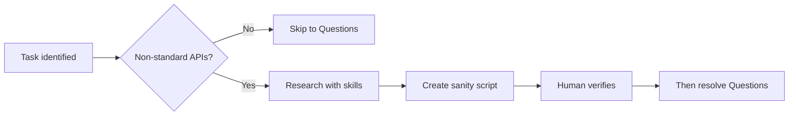
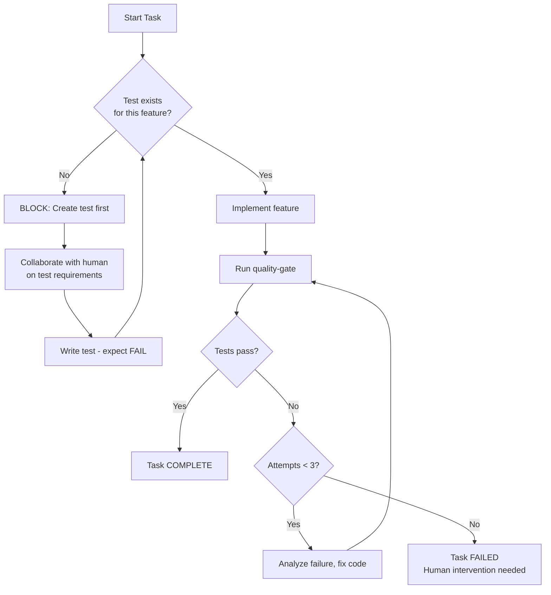

# Task Orchestration Skill

Execute tasks from a collaborative **task file** (e.g., `0N_TASKS.md`) with **enforced** hooks:

- **Questions/Blockers Gate**: BLOCKS execution if unresolved questions exist
- **Memory-first Pre-hook**: Queries memory BEFORE each task (not optional)
- **Quality-gate Post-hook**: Runs tests AFTER each task (must pass)
- **Session Archiving**: Stores completed session for future recall
- **Task-Monitor Integration**: MANDATORY watchdog monitoring for all orchestrations

## ⚠️ CRITICAL: Task-Monitor is MANDATORY

**Before running `/orchestrate`, you MUST start the task-monitor watchdog:**

```bash
# 1. Start task-monitor TUI in background (REQUIRED)
.pi/skills/task-monitor/run.sh tui &

# 2. Now run orchestrate
/orchestrate 01_TASKS.md
```

**Why this is mandatory:**
- Orchestrations run 5-30+ minutes
- Without monitoring, you won't know if process crashes, stalls, or hits errors
- Task-monitor provides real-time progress, error tracking, and alerts
- Enables early detection of failures (saves hours of wasted compute)

**The task-monitor acts as your watchdog** - it tracks:
- Task progress and completion status
- Error counts and recent failures
- Budget usage and cost tracking
- Provider fallbacks and rate limits
- Timing and duration per task

**If task-monitor is not running:**
1. Agent loses visibility into orchestration progress
2. Failures discovered only after full run completes
3. No early warnings for budget overruns or errors
4. Cannot debug stuck or stalled tasks

**Rule**: Do NOT run `/orchestrate` without starting `/task-monitor` first.

### Platform Support & Development Override

**Supported Platforms**: macOS and Linux (requires `pgrep` command, which is pre-installed)

**Windows**: Not currently supported. Task-monitor enforcement uses `pgrep`, which is unavailable on Windows. Windows support can be added in the future using PowerShell-based process detection.

**Development Override**: For testing/development, you can skip the task-monitor check:
```bash
ORCHESTRATE_SKIP_MONITOR_CHECK=1 /orchestrate 01_TASKS.md
```

**Security Note**: The task-monitor check now uses a more specific process pattern (`python.*task-monitor/monitor\.py`) to prevent false positives from similarly-named processes.

## ⚠️ CRITICAL: Agent Monitoring Responsibilities

**After orchestration starts, the agent MUST stay engaged and monitor until completion.**

### 1. Stay Engaged Until ALL Tasks Complete

Orchestrations run 5-30+ minutes. You cannot "start and forget."

**❌ WRONG PATTERN:**
```
Agent: "I've started the orchestration. It's running in the background."
[Returns to user immediately]
[Orchestration fails 20 minutes later - agent doesn't know]
```

**✅ CORRECT PATTERN:**
```
Agent: "Starting orchestration of 10 tasks. Monitoring progress..."
[Checks task-monitor every 1-2 minutes]
[After 25 minutes, all tasks complete]
Agent: "✅ All 10 tasks completed successfully. Session archived. Results: [summary]"
```

### 2. Monitor for Blockers and Errors

**Check every 1-2 minutes for:**

| Sign | Meaning | Action Required |
|------|---------|-----------------|
| `❌ BLOCKED: Questions/Blockers unresolved` | Task needs human input | Ask human, update task file |
| `CLARIFY: Task needs clarification` | Agent needs guidance | Read context, ask human |
| `⚠️ Test failures increasing` | Quality gate failing repeatedly | Review test output, intervene |
| `❌ Budget exceeded` | Cost limit reached | Alert user, consider increasing budget |
| Task stuck >5 min | Stall or infinite loop | Check logs, intervene |
| Errors increasing | Tests or code failing | Review recent task output |

**When blocked:**
1. Read the blocker message carefully
2. Ask human for required information
3. Update task file with answers
4. Resume orchestration (if paused)

### 3. Check Task-Monitor TUI Regularly

**Healthy progress looks like:**
```
Task 8/10: Running (2m 15s)
Errors: 0
Budget: $2.30/$5.00 (46%)
Provider: github (FREE) → anthropic (fallback x1)
```

**Warning signs:**
```
Task 3/10: Running for 15 min (expected: 2-3 min) ← STALL
Errors: 42 (increasing rapidly) ← BAD
Budget: $4.50/$5.00 (90%) ← ALERT
```

### 4. Provide Periodic Progress Updates

For long orchestrations (15+ min), give user updates every 5-10 minutes:

```
Agent: "Task 3/10 complete. All tests passing. Budget: $1.20/$5.00 (24%)."
[5 minutes later]
Agent: "Task 6/10 complete. Provider fallback used once (rate limit). Budget: $2.10/$5.00 (42%)."
[10 minutes later]
Agent: "Task 10/10 complete. Final cost: $3.80/$5.00. Archiving session..."
```

### 5. Verification Before Reporting Complete

**Before telling the user "orchestration complete", verify:**
- [ ] All tasks show `[x]` completed in task file
- [ ] Error count = 0 or expected level in task-monitor
- [ ] Budget not exceeded (or acknowledged if over)
- [ ] No "BLOCKED" messages in orchestration output
- [ ] Session archived successfully
- [ ] All Definition of Done tests passing

**Only then** report completion with:
- Summary of tasks completed
- Actual cost used vs budget
- Any issues encountered and resolved
- Session archive location

### 6. The Monitoring Loop

```python
# Pseudo-code for agent monitoring behavior
while orchestration_running:
    # Check task-monitor TUI
    check_task_monitor_status()

    # Check orchestration output
    check_for_blockers()
    check_for_errors()

    # Take action if needed
    if blocked_on_questions:
        ask_human_for_input()
        update_task_file()
    elif errors_detected:
        review_logs()
        intervene()
    elif stalled:
        investigate_and_fix()

    # Update user periodically
    if time_since_last_update > 5_minutes:
        report_progress_to_user()

    # Wait before next check
    sleep(60-120 seconds)

# After loop completes
verify_all_criteria_met()
report_final_results()
```

## ❌ ANTI-PATTERNS: Never Do This

**These patterns bypass quality gates and WILL cause failures that compound silently.**

### Raw Pipeline Commands (FORBIDDEN)

| ❌ NEVER DO THIS | ✅ DO THIS INSTEAD |
|------------------|-------------------|
| `nohup python -m pipeline.stage_05 &` | `/orchestrate 01_PIPELINE_TASKS.md` |
| `python -m sparta.pipeline_duckdb.05_extract` | Create task file with Definition of Done |
| `uv run python -m batch_processor` | `/batch-quality preflight` first |
| `nohup ... & tail -f nohup.out` | `/task-monitor` with `--require-validation` |
| Running stages manually "to save time" | Task file + orchestrate (actually faster long-term) |

### Why Raw Commands Are Forbidden

When you run `nohup python -m some_pipeline &` instead of using orchestrate, you bypass:

1. **Memory-first pre-hooks** → You miss known solutions to problems you'll encounter
2. **Quality-gate post-hooks** → Errors compound silently across stages
3. **Task-monitor tracking** → No visibility into progress or failures
4. **Session archiving** → Future agents can't learn from your run
5. **Preflight validation** → You burn tokens on broken prompts/configs

### Real Failure Example (January 2026)

An agent was asked to "run SPARTA pipeline stages 05, 06, 08, 08b". Instead of using orchestrate:

```bash
# ❌ WHAT THE AGENT DID (WRONG)
nohup uv run python -m sparta.pipeline_duckdb.05_extract_knowledge --run-id run-recovery-verify &
tail -f nohup.out  # Manual monitoring
# Repeated for each stage...
```

**Result:** 7-hour run with:
- No memory recall (missed known NoneType fix)
- No quality validation between stages
- No task tracking
- Errors discovered only at the end
- No lessons stored for future agents

```bash
# ✅ WHAT THE AGENT SHOULD HAVE DONE
# 1. Create task file
cat > 01_SPARTA_TASKS.md << 'EOF'
# SPARTA Pipeline Tasks

## Tasks
- [ ] **Task 1**: Run Stage 05 - Extract Knowledge
  - **Definition of Done**: url_knowledge table has >30,000 rows

- [ ] **Task 2**: Run Stage 06 - Embed Knowledge
  - Dependencies: Task 1
  - **Definition of Done**: 100% of excerpts have embeddings
EOF

# 2. Use orchestrate
/orchestrate 01_SPARTA_TASKS.md
```

### Detection Triggers

If you find yourself typing any of these patterns, STOP and use orchestrate:

- `nohup ... &`
- `python -m .*pipeline`
- `python -m .*extract`
- `python -m .*batch`
- `uv run python -m .*stage`
- `tail -f nohup.out`
- `disown`
- `screen` or `tmux` for "background pipeline"

### The 5-Minute Rule

**If a task will take more than 5 minutes, it MUST go through orchestrate.**

Why? Because:
- You WILL forget to check results
- Errors WILL compound
- You WILL NOT store lessons
- Future agents WILL repeat your mistakes

## ⚠️ Non-Negotiable: Sanity Scripts + Completion Tests

**Without these, the orchestrator WILL hallucinate and errors WILL compound.**

LLMs cannot reliably verify their own work. Without external validation:

- Agent "completes" Task 1 with subtle bug
- Task 2 builds on broken Task 1
- Task 3 compounds the errors
- By Task 5, the codebase is corrupted beyond repair

**The ONLY defense: Working sanity scripts + completion tests that are DIVORCED from project complexity.**

Every task file MUST include (via human-agent collaboration):

| Requirement         | Purpose                                       | When Created          | Example                                                       |
| ------------------- | --------------------------------------------- | --------------------- | ------------------------------------------------------------- |
| **Sanity Script**   | Proves dependencies/APIs work IN ISOLATION    | BEFORE implementation | `sanity/camelot.py` - extracts a table from a simple test PDF |
| **Completion Test** | Proves task succeeded with CONCRETE assertion | BEFORE implementation | `test_table_extractor.py::test_extracts_3_tables`             |

### Which Packages Need Sanity Scripts?

**Only create sanity scripts for packages where the agent might hallucinate usage:**

| Needs Sanity Script            | Examples                              | Why                                |
| ------------------------------ | ------------------------------------- | ---------------------------------- |
| ✅ Little-known packages       | `camelot`, `pdfplumber`, `surya`      | Agent may not know correct API     |
| ✅ Complex APIs                | `transformers`, `opencv`, `paddleocr` | Many parameters, easy to get wrong |
| ✅ User/project-generated code | `myproject.utils`, custom modules     | Not in training data               |
| ❌ Standard library            | `json`, `os`, `pathlib`, `typing`     | Well-documented, agent knows these |
| ❌ Well-known packages         | `requests`, `numpy`, `pandas`         | Widely used, agent reliable here   |

### Why "Divorced from Project Complexity"?

Sanity scripts must test the CORE FUNCTIONALITY in isolation:

```python
# GOOD: Tests Camelot API works (little-known package)
# sanity/camelot_tables.py
import camelot
tables = camelot.read_pdf("fixtures/simple_table.pdf", flavor="lattice")
assert len(tables) > 0, "Camelot failed to extract any tables"
print(f"PASS: Extracted {len(tables)} tables, accuracy={tables[0].parsing_report['accuracy']}")

# BAD: Testing json.loads (standard library - agent knows this)
# sanity/json_parsing.py
import json
data = json.loads('{"key": "value"}')  # Pointless - agent won't hallucinate this

# BAD: Tests your whole pipeline, hides where failure occurs
# sanity/camelot_tables.py
from myproject.pipeline import extract_tables  # Too coupled!
result = extract_tables("complex_document.pdf")  # Too complex!
```

**Rule of thumb**: If you'd trust a junior developer to use the API correctly from memory, skip the sanity script. If YOU had to look up the docs, create one.

**The task file is INCOMPLETE without both.** Do not proceed to implementation until:

1. Sanity scripts pass (dependencies verified IN ISOLATION)
2. Completion tests are defined (Definition of Done with CONCRETE assertions)

Run pre-flight check: `./preflight.sh 01_TASKS.md`

This is collaborative work - agent proposes, human verifies/refines.

## The Collaborative Workflow

```mermaid
flowchart TB
    subgraph Phase1["PHASE 1: Collaborate on Task File"]
        H1[Human: I need to refactor auth] --> A1[Agent creates 0N_TASKS.md]
        A1 --> Q1["## Questions/Blockers<br/>- Which auth method?<br/>- Backwards compat?"]
        Q1 --> H2[Human answers questions]
        H2 --> S1["Create SANITY SCRIPTS<br/>for non-standard deps"]
        S1 --> S2{Sanity<br/>scripts pass?}
        S2 -->|No| S3[Fix deps/scripts<br/>with human]
        S3 --> S1
        S2 -->|Yes| T1["Define COMPLETION TESTS<br/>for each task"]
        T1 --> T2[Human approves<br/>Definition of Done]
        T2 --> Q2["Questions resolved → None<br/>Sanity: PASS<br/>Tests: DEFINED"]
    end

    subgraph Phase2["PHASE 2: Execute via orchestrate tool"]
        O1["orchestrate({ taskFile })"] --> Check{Blockers<br/>exist?}
        Check -->|Yes| Block[BLOCKED - Resolve first]
        Check -->|No| SanityCheck{Sanity<br/>scripts pass?}
        SanityCheck -->|No| Block2[BLOCKED - Fix sanity first]
        SanityCheck -->|Yes| Loop["For each task:"]
        Loop --> Pre["PRE-HOOK: memory recall"]
        Pre --> Exec["Execute: pi --no-session"]
        Exec --> Post["POST-HOOK: Run Definition of Done test"]
        Post --> Pass{Test<br/>passes?}
        Pass -->|Yes| Update["Update: [ ] → [x]"]
        Pass -->|No| Retry{Attempts < 3?}
        Retry -->|Yes| Fix[Analyze, fix, retry]
        Fix --> Exec
        Retry -->|No| Fail[HARD FAIL - Human needed]
        Update --> Next{More<br/>tasks?}
        Next -->|Yes| Loop
        Next -->|No| Done[All complete]
    end

    subgraph Phase3["PHASE 3: Archive"]
        Archive["episodic-archiver<br/>→ Future recall enabled"]
    end

    Phase1 --> Phase2
    Done --> Phase3
```



## Human-Agent Collaboration: Creating Sanity Scripts + Tests

Before ANY implementation begins, agent and human collaborate to create:

### Step 1: Identify Dependencies → Create Sanity Scripts

```
Agent: "Task 2 requires Camelot for table extraction. I'll create a sanity script."
Agent: [Creates sanity/camelot_tables.py with working example]
Agent: "Please verify this works in your environment: python sanity/camelot_tables.py"
Human: [Runs script] "It fails - ghostscript not installed"
Agent: [Updates script with installation check and clearer error]
Human: [Runs again] "PASS - extracts 3 tables correctly"
Agent: [Marks sanity script as verified in task file]
```

### Step 2: Define Completion Tests → Definition of Done

```
Agent: "For Task 2 (extract tables from PDF), what proves success?"
Human: "It should find all 5 tables in the test PDF and preserve headers"
Agent: "I'll define the test:
  - Test: tests/test_table_extractor.py::test_extracts_all_tables
  - Assertion: Extracts exactly 5 tables from fixtures/sample.pdf with headers intact"
Human: "Add a test for empty PDFs too"
Agent: [Updates Definition of Done with both tests]
```

### Step 3: Write Failing Tests FIRST

```
Agent: [Creates test file with tests that will FAIL]
Agent: "Tests are written but failing (as expected). Ready to implement?"
Human: "Yes, proceed"
Agent: [Implements feature, runs tests, they pass]
```

**Key principle**: No surprises. Human knows exactly what "done" means before coding starts.

## Pre-Flight Checklist (Runs Before Any Task Executes)

Before executing ANY task, the orchestrator runs a pre-flight check:

```mermaid
flowchart TB
    Start[orchestrate called] --> PF["PRE-FLIGHT CHECK"]
    PF --> Q{Questions/<br/>Blockers?}
    Q -->|Yes| Block1[❌ BLOCKED: Resolve questions first]
    Q -->|No| S{Sanity scripts<br/>exist?}
    S -->|Missing| Block2[❌ BLOCKED: Create sanity scripts first]
    S -->|Exist| SP{Sanity scripts<br/>PASS?}
    SP -->|Fail| Block3[❌ BLOCKED: Fix sanity scripts first]
    SP -->|Pass| T{Definition of Done<br/>defined for all tasks?}
    T -->|Missing| Block4[❌ BLOCKED: Define completion tests first]
    T -->|Defined| TF{Test files<br/>exist?}
    TF -->|Missing| Block5[❌ BLOCKED: Create test files first]
    TF -->|Exist| Ready[✅ PRE-FLIGHT PASS<br/>Begin execution]
```



### Pre-Flight Checklist Items

| Check                             | What It Validates                             | Failure Action                      |
| --------------------------------- | --------------------------------------------- | ----------------------------------- |
| **1. Questions/Blockers**         | No unresolved items in section                | BLOCK - collaborate to resolve      |
| **2. Sanity Scripts Exist**       | Each dependency in table has a script file    | BLOCK - create scripts with human   |
| **3. Sanity Scripts Pass**        | `python sanity/*.py` all exit 0               | BLOCK - fix deps/scripts with human |
| **4. Definition of Done Defined** | Each implementation task has Test + Assertion | BLOCK - define tests with human     |
| **5. Test Files Exist**           | Referenced test files actually exist          | BLOCK - create test files first     |

### Pre-Flight Output

```
=== PRE-FLIGHT CHECK: 01_TASKS.md ===

[1/5] Questions/Blockers... ✅ None
[2/5] Sanity scripts exist...
      - sanity/camelot_tables.py ✅
      - sanity/pdfplumber_tables.py ✅
[3/5] Sanity scripts pass...
      - sanity/camelot_tables.py ✅ (exit 0)
      - sanity/pdfplumber_tables.py ❌ (exit 1: ghostscript missing)

❌ PRE-FLIGHT FAILED: Sanity script failed
   Fix: Install ghostscript or update sanity script

   Cannot proceed until all sanity scripts pass.
```

### Why Pre-Flight Matters

Without pre-flight:

1. Task 1 executes successfully
2. Task 2 starts, needs Camelot
3. Camelot fails (ghostscript missing)
4. Task 2 fails, error compounds
5. Task 3 depends on Task 2, also fails
6. Wasted effort, corrupted state

With pre-flight:

1. Check sanity scripts BEFORE any execution
2. Camelot sanity fails immediately
3. Human fixes ghostscript
4. Re-run pre-flight, all pass
5. NOW execute tasks with confidence

**Pre-flight is cheap. Failed tasks are expensive.**

## Critical: Questions/Blockers Section

The orchestrator **BLOCKS** execution if unresolved questions exist:

```markdown
## Questions/Blockers

- Which database should we use? (blocks Task 3)
- Do we need backwards compatibility?
```

**To proceed**: Answer the questions and either:

- Remove the items
- Change to "None" or "N/A"

This forces collaborative clarification BEFORE coding starts.

## Sanity-First Collaboration (Crucial Dependencies)

> **NEW**: For non-standard APIs, create sanity scripts BEFORE marking Questions/Blockers as resolved.

When a task requires libraries/APIs beyond standard ones (`json`, `pathlib`, `typing`, etc.), the agent must:

### Phase 1a: Dependency Identification



### Research Skill Priority

1. **brave-search** (free) - General patterns, StackOverflow, blog posts
2. **Context7** (free) - Library-specific documentation chunks
3. **perplexity** (paid) - Complex research, comparisons (use sparingly)

### Sanity Script Requirements

Each non-standard dependency gets a script in `tools/tasks_loop/sanity/`:

```python
# sanity/{library}.py - Agent REFERENCES this when implementing
"""
PURPOSE: Working example with correct parameters
DOCUMENTATION: Context7 query used, last verified date
"""
# Must show: imports, parameters with values, expected output, edge cases
# Exit codes: 0=PASS, 1=FAIL, 42=CLARIFY (needs human)
```

**Example**: Before using Camelot for table extraction, create `sanity/camelot_table_extraction.py` that shows:

- Both `lattice` and `stream` modes
- `line_scale`, `edge_tol`, `row_tol` parameters with valid values
- How to check accuracy scores
- Known issues (ghostscript dependency, etc.)

### Task File with Dependencies

```markdown
## Crucial Dependencies

| Library    | API/Method         | Sanity Script          | Status       |
| ---------- | ------------------ | ---------------------- | ------------ |
| camelot    | `read_pdf()`       | `sanity/camelot.py`    | [x] verified |
| pdfplumber | `extract_tables()` | `sanity/pdfplumber.py` | [ ] pending  |

## Questions/Blockers

- [ ] All sanity scripts must pass before this resolves to "None"
```

### Why This Matters

1. **Agent learns from working examples** - Not just "use camelot" but exactly how
2. **Parameters are documented** - `line_scale=40` with explanation of why
3. **Edge cases captured** - "Needs ghostscript installed"
4. **Human verification** - Confirms the script actually works
5. **Future agents benefit** - Sanity scripts persist for recall

## Task File Format: 0N_TASKS.md

```markdown
# Task List: <Project/Feature Name>

## Context

<Brief description of what we're trying to accomplish>

## Crucial Dependencies (Sanity Scripts)

| Library    | API/Method         | Sanity Script                 | Status      |
| ---------- | ------------------ | ----------------------------- | ----------- |
| camelot    | `read_pdf()`       | `sanity/camelot_tables.py`    | [x] PASS    |
| pdfplumber | `extract_tables()` | `sanity/pdfplumber_tables.py` | [ ] PENDING |

> ⚠️ All sanity scripts must PASS before proceeding to implementation.

## Tasks

- [ ] **Task 1**: <Clear, actionable description>

  - Agent: general-purpose
  - Parallel: 0
  - Dependencies: none
  - Notes: <any context>
  - **Sanity**: `sanity/camelot_tables.py` (must pass first)
  - **Definition of Done**:
    - Test: `tests/test_feature.py::test_task1_behavior`
    - Assertion: <what the test proves>

- [ ] **Task 2**: <Description>

  - Agent: general-purpose
  - Parallel: 1
  - Dependencies: Task 1
  - Notes: <context>
  - **Sanity**: None (uses json, pathlib, requests - well-known APIs)
  - **Definition of Done**:
    - Test: `tests/test_feature.py::test_task2_behavior`
    - Assertion: <what the test proves>

- [ ] **Task 3**: <Description>
  - Agent: explore
  - Parallel: 1
  - Dependencies: none
  - **Sanity**: N/A (research only)
  - **Definition of Done**: N/A (research only, no code changes)

## Completion Criteria

<How do we know we're done?>

## Questions/Blockers

None - all questions resolved, all sanity scripts pass.
```

### The "Definition of Done" Field

**Every implementation task MUST have a Definition of Done** that specifies:

1. **Test file/function**: The exact test that verifies this task
2. **Assertion**: What the test proves (in plain English)

Examples:

```markdown
- **Definition of Done**:

  - Test: `tests/core/providers/test_image.py::test_vlm_fallback_to_ocr`
  - Assertion: When VLM returns garbage (<100 chars), OCR fallback is triggered

- **Definition of Done**:

  - Test: `tests/api/test_auth.py::test_refresh_token_expired`
  - Assertion: Expired refresh tokens return 401 and clear session

- **Definition of Done**: N/A (documentation only)
```

**If no test exists**, the task file should note this:

```markdown
- **Definition of Done**:
  - Test: MISSING - must be created before implementation
  - Assertion: <describe what we need to verify>
```

This forces collaborative discussion about what "done" means BEFORE coding starts.

**Test = Gate Enforcement**:
When you specify a test file in the `Test:` field, the orchestrator **AUTOMATICALLY** enables "Retry Until Pass" mode.

- It treats the test file as a **Quality Gate**.
- The agent will be forced to Loop (analyze -> fix -> retry) up to 3 times (default) until that specific test passes.
- This prevents "hallucinated completion" where the agent says "I fixed it" but didn't run the test.

## The orchestrate Tool

### Basic Usage

```typescript
orchestrate({
  taskFile: "01_TASKS.md", // Path to task file
  continueOnError: false, // Stop on first failure (default)
  archive: true, // Archive on completion (default)
  taskTimeoutMs: 1800000, // 30 min per task (default)
});
```

### What Happens

1. **PRE-FLIGHT CHECK** (MANDATORY - runs `./preflight.sh`):

   - ❌ Questions/Blockers exist? → BLOCKED
   - ❌ Sanity scripts missing? → BLOCKED
   - ❌ Sanity scripts fail? → BLOCKED
   - ❌ Definition of Done missing? → BLOCKED
   - ❌ Test files missing? → BLOCKED
   - ✅ All checks pass → Proceed to execution

2. **For Each Task**:

   - **PRE-HOOK**: `~/.pi/agent/skills/memory/run.sh recall --q "<task>"`
     - If solutions found → injected as context in task prompt
     - Agent decides how to use prior knowledge
   - **EXECUTE**: `pi --mode json -p --no-session "<task prompt>"`
     - Protected context, no session bleed
     - **INSTRUCTION**: "Run the Definition of Done test to verify before finishing"
     - Agent config provides system prompt
   - **POST-HOOK**: Run the specific Definition of Done test for this task
     - NOT the whole test suite - just the task's specific test
     - Task FAILS if test doesn't pass
     - Retry up to 3 times before hard failure
   - **UPDATE**: Mark checkbox `[x]` in task file

3. **Archive**: Store session via episodic-archiver

**If pre-flight fails, orchestrator REFUSES to execute.** Fix issues first.

### Memory Recall Context

When memory finds prior solutions, they're injected into the task prompt:

```markdown
## Memory Recall (Prior Solutions Found)

The following relevant solutions were found in memory. Review and adapt as needed:

1. **Problem**: OAuth token refresh failing silently
   **Solution**: Add explicit error handling in refreshToken(), log failures

---

## Context

...rest of task prompt...
```

The agent sees this context and decides whether to apply, adapt, or ignore it.

### Quality Gate Enforcement

After each task, `quality-gate.sh` runs:

```bash
# Auto-detects project type and runs:
# - Python: pytest -q -x
# - Node: npm test
# - Go: go test ./...
# - Rust: cargo check
# - Makefile: make test (or make smokes)
```

If tests fail:

- Task status = `failed`
- Error output included in results
- Orchestration stops (unless `continueOnError: true`)

## When to Use

| Trigger                   | Action                                   |
| ------------------------- | ---------------------------------------- |
| "Let's plan this"         | Collaborate on task file (don't run yet) |
| "Run the tasks"           | Execute via orchestrate tool             |
| "Orchestrate 01_TASKS.md" | Execute specific file                    |
| "Schedule nightly"        | Schedule via `orchestrate schedule`      |
| Unresolved questions      | BLOCKED - clarify first                  |

## Parallel Task Execution

Tasks can run in parallel groups using the `Parallel` field:

```markdown
- [ ] **Task 1**: Setup database
  - Parallel: 0       # Group 0 runs FIRST (sequentially before any parallel tasks)

- [ ] **Task 2**: Create API endpoints
  - Parallel: 1       # Group 1 tasks run IN PARALLEL after Group 0 completes
  - Dependencies: Task 1

- [ ] **Task 3**: Create frontend components
  - Parallel: 1       # Also Group 1 - runs CONCURRENTLY with Task 2
  - Dependencies: Task 1

- [ ] **Task 4**: Integration tests
  - Parallel: 2       # Group 2 runs after ALL Group 1 tasks complete
  - Dependencies: Task 2, Task 3
```

**Execution Order:**
1. All `Parallel: 0` tasks run sequentially (respecting dependencies)
2. All `Parallel: 1` tasks run concurrently (after their dependencies are met)
3. All `Parallel: 2` tasks run concurrently (after Group 1 completes)
4. And so on...

**Rules:**
- Tasks in the same group with unmet dependencies wait until dependencies complete
- Lower parallel numbers run before higher numbers
- Default is `Parallel: 0` (runs first, sequential)

## Task-Monitor Integration

Orchestrate automatically pushes progress to the **task-monitor** TUI:

```
┌─────────────────────────────────────────────────────┐
│  orchestrate:01_TASKS.md:abc123    [=====>   ] 3/5 │
│  Group 1: Create API endpoints, Create frontend     │
│  Status: running  |  Success: 2  |  Failed: 0       │
└─────────────────────────────────────────────────────┘
```

**Configuration:**
```bash
# Environment variables
TASK_MONITOR_API_URL=http://localhost:8765  # Default
TASK_MONITOR_ENABLED=true                    # Default, set to "false" to disable
```

**Start the monitor TUI:**
```bash
.pi/skills/task-monitor/run.sh tui
```

## Scheduler Integration

Schedule recurring task file executions via the scheduler skill:

```bash
# Schedule nightly runs
orchestrate schedule 01_TASKS.md --cron "0 2 * * *"

# Schedule hourly
orchestrate schedule maintenance.md --cron "0 * * * *"

# Remove from schedule
orchestrate unschedule 01_TASKS.md

# View scheduled jobs
scheduler list
```

**Automatic Registration:**
- Completed orchestrations automatically register with the scheduler (disabled by default)
- Use `orchestrate schedule` to explicitly schedule with cron

**Integration with task-monitor:**
The task-monitor TUI shows both:
- Running orchestrations (real-time progress)
- Upcoming scheduled jobs (from `~/.pi/scheduler/jobs.json`)

## Agent Selection

Specify agent per task in the task file:

| Agent             | Use For                                      |
| ----------------- | -------------------------------------------- |
| `general-purpose` | Code changes, bug fixes, implementation      |
| `explore`         | Research, code exploration, finding patterns |

Agent configs live at `~/.pi/agent/agents/<name>.md` with:

- Frontmatter: name, description, tools, model
- Body: System prompt with instructions

## Model Selection (Cost Optimization)

**New in 2026**: Per-task model selection with automatic escalation for intelligent cost optimization.

### Quick Reference

```markdown
# Simple task → Use Haiku (saves 66% vs Sonnet)
- [ ] **Task 1**: Format code files
  - Agent: general-purpose
  - Model: claude-haiku-4-5-20251001  # $1/$5 MTok

# Standard task → Use default (Sonnet)
- [ ] **Task 2**: Refactor authentication
  - Agent: general-purpose
  # No Model field → defaults to claude-sonnet-4-5-20250929 ($3/$15)

# Complex task → Start balanced, escalate to premium
- [ ] **Task 3**: Redesign database schema
  - Agent: general-purpose
  - Model: claude-sonnet-4-5-20250929         # Try balanced first
  - EscalateModel: claude-opus-4-5-20251101   # Escalate to premium
  - EscalateAfter: 2                          # After 2 failed attempts
  - MaxEscalations: 2                         # Up to 2 Opus attempts
  - MaxRetries: 5                             # Total 5 attempts
```

### Model Cost Tiers

| Model | API Identifier | Cost/MTok | Use For |
|-------|---------------|-----------|---------|
| **Haiku 4.5** | `claude-haiku-4-5-20251001` | $1/$5 | Simple tasks - file ops, formatting |
| **Sonnet 4.5** | `claude-sonnet-4-5-20250929` | $3/$15 | **Default** - standard coding, refactoring |
| **Opus 4.5** | `claude-opus-4-5-20251101` | $5/$25 | Complex architecture, critical bugs |

**Default**: If no `Model` field specified, uses `claude-sonnet-4-5-20250929` (Anthropic's recommended balanced model)

### Escalation Logic

```markdown
- Model: claude-haiku-4-5-20251001          # Base model
- EscalateModel: claude-sonnet-4-5-20250929 # Escalate to this
- EscalateAfter: 2                          # After N failed attempts
- MaxEscalations: 2                         # Budget limit
- MaxRetries: 5                             # Total attempts
```

**How it works:**
1. **Attempts 1-2**: Uses `Model` (Haiku - $1/$5)
2. **Attempts 3-4**: Escalates to `EscalateModel` (Sonnet - $3/$15)
3. **Attempt 5**: Falls back to `Model` (escalation budget exhausted)

**Each attempt logged:** `FIX ATTEMPT 2 (model: claude-sonnet-4-5-20250929)`

### Cost Savings

**Scenario**: 10 simple tasks

| Approach | Cost |
|----------|------|
| All use Sonnet | 10 × $3 = **$30** |
| 9 succeed with Haiku, 1 escalates | (9 × $1) + (1 × $3) = **$12** (60% savings) |

**Key insight**: Start cheap, escalate only when needed.

### Validation

Preflight checks validate model identifiers:

```bash
$ ./preflight.sh 01_TASKS.md

[8/8] Model selection validation...
      ✅ claude-haiku-4-5-20251001
      ✅ claude-sonnet-4-5-20250929
      ✅ claude-opus-4-5-20251101
```

Invalid models are blocked:
```
      ❌ gpt-4-turbo (UNKNOWN MODEL)
      Valid models: claude-haiku-4-5-20251001 claude-sonnet-4-5-20250929 ...
```

### Field Reference

| Field | Type | Default | Description |
|-------|------|---------|-------------|
| `Model` | string | `claude-sonnet-4-5-20250929` | Base model for initial attempts |
| `EscalateModel` | string | - | More powerful model to escalate to |
| `EscalateAfter` | number | 2 | Number of attempts before escalating |
| `MaxEscalations` | number | 2 | Maximum escalation attempts allowed |
| `MaxRetries` | number | 3 | Total retry attempts (includes escalations) |

**Note**: Use exact snapshot identifiers (e.g., `claude-sonnet-4-5-20250929`) not aliases, for consistent behavior.

## Code Review Integration

**New in 2026**: Post-orchestration code review using the `/review-code` skill.

### Quick Reference

```markdown
# Task file with post-orchestration review
# Add review configuration before tasks section

review_after_completion: true
review_provider: github        # FREE via GitHub Copilot
review_model: claude-sonnet-4.5  # or gpt-5

## Tasks
...
```

### How It Works

After all tasks complete successfully, orchestrate automatically:
1. Captures git diff of all changes
2. Calls `/review-code` skill with the configured provider/model
3. Appends review output to orchestration summary
4. Review failures don't fail the orchestration (logged only)

### Provider Options

| Provider | Models Available | Cost | Use When |
|----------|-----------------|------|----------|
| **github** | `gpt-5`, `claude-sonnet-4.5` | **FREE*** | Default - included in Copilot subscription |
| **anthropic** | `claude-sonnet-4-5`, `claude-opus-4-5` | Paid | Need latest Claude models |
| **openai** | `gpt-5.2-codex`, `o3`, `gpt-5` | Paid | High reasoning tasks |
| **google** | `gemini-2.0-flash`, `gemini-1.5-pro` | Paid | Alternative provider |

**\*FREE**: GitHub Copilot includes access to both GPT-5 and Claude Sonnet 4.5 at no additional cost beyond the $10/month subscription.

### Configuration Fields

| Field | Type | Default | Description |
|-------|------|---------|-------------|
| `review_after_completion` | boolean | `false` | Enable post-orchestration review |
| `review_provider` | string | - | Provider to use for review (github/anthropic/openai/google) |
| `review_model` | string | - | Model to use for review |

### Example: GitHub Copilot (FREE)

```markdown
# Cost-optimized review using GitHub Copilot
review_after_completion: true
review_provider: github
review_model: claude-sonnet-4.5  # FREE via Copilot

## Tasks
- [ ] **Task 1**: Implement OAuth endpoints
  - Agent: general-purpose
  - Model: claude-haiku-4-5-20251001  # Save on implementation
  ...
```

**Cost Analysis**:
- Implementation: Haiku $1/$5 (cheap)
- Review: GitHub Copilot Claude Sonnet 4.5 (FREE)
- **Total marginal cost**: ~$1 (vs $3+ without optimization)

### Example: High-Reasoning Review

```markdown
# Premium review for critical code
review_after_completion: true
review_provider: openai
review_model: gpt-5.2-codex  # High reasoning

## Tasks
...
```

### Validation

Preflight checks validate review configuration:

```bash
$ ./preflight.sh 01_TASKS.md

[9/9] Review configuration validation...
      ✅ Post-orchestration review enabled
      ✅ review-code skill available
      ✅ Review provider: github
      ✅ Review model: claude-sonnet-4.5
```

Invalid configurations are blocked:
```
      ❌ Invalid review provider: invalid-provider
      Valid providers: github, anthropic, openai, google
```

### Output Example

After tasks complete, review appears in summary:

```
Orchestration completed
Tasks: 3/3 completed

Results:
- Task 1 (general-purpose): success [2m 15s]
- Task 2 (general-purpose): success [3m 42s]
- Task 3 (general-purpose): success [1m 58s]

=== CODE REVIEW ===
Review completed successfully.

Changes analyzed: 15 files, 342 additions, 89 deletions

Findings:
1. SECURITY: Potential SQL injection in user_controller.ts:42
   Recommendation: Use parameterized queries

2. PERFORMANCE: N+1 query in get_users() function
   Recommendation: Add .prefetch_related('groups')

3. STYLE: Inconsistent error handling in auth module
   Recommendation: Use standardized error wrapper

Suggested fixes available in review output.

Session archived to episodic memory.
Full task outputs: /tmp/pi-orchestrate-abc123/
```

### When to Use

**Post-orchestration review** is best for:
- Final validation after all changes complete
- Comprehensive cross-file analysis
- Cost efficiency (one review vs N reviews)

**Not recommended for**:
- Catching issues early (use per-task gates instead)
- Iterative development (review happens at end)

### Integration with /plan

The `/plan` skill template includes review configuration placeholders.
When planning, specify review preferences and they'll be included in generated task files.

## Provider-Based Selection & Fallback (Phase 2)

**New in 2026**: Multi-provider support with automatic fallback for rate limits and downtime.

### Quick Reference

```markdown
# Use GitHub Copilot (FREE) with fallback
- [ ] **Task 1**: Implement OAuth
  - Agent: general-purpose
  - Provider: github                         # FREE via Copilot
  - Model: claude-sonnet-4.5                 # FREE
  - FallbackProvider: anthropic              # If GitHub is down/rate-limited
  - FallbackModel: claude-sonnet-4-5-20250929  # Paid fallback

# Cost-optimized with cheap fallback
- [ ] **Task 2**: Format code files
  - Agent: general-purpose
  - Provider: anthropic
  - Model: claude-haiku-4-5-20251001         # Start cheap ($1/$5)
  - FallbackProvider: google
  - FallbackModel: gemini-2.0-flash           # Even cheaper fallback ($0.075/$0.3)
```

### Supported Providers

| Provider | CLI | Models Available | Cost | Best For |
|----------|-----|-----------------|------|----------|
| **github** | `copilot` | `claude-sonnet-4.5`, `gpt-5` | **FREE*** | Default - included in Copilot subscription |
| **anthropic** | `pi --provider anthropic` | All Claude models | Paid | Latest Claude models |
| **openai** | `codex` or `pi --provider openai` | `gpt-5.2-codex`, `o3`, `gpt-5` | Paid | High reasoning tasks |
| **google** | `pi --provider google` | `gemini-2.0-flash`, `gemini-1.5-pro` | Paid | Alternative provider |

**\*FREE**: Included in GitHub Copilot subscription ($10/month)

### Automatic Fallback

Orchestrate automatically retries with fallback provider if primary fails due to:
- **Rate limits**: 429, "rate limit exceeded", "quota exceeded"
- **Provider downtime**: 503, "service unavailable", connection refused, timeout

**Workflow**:
```
1. Try primary provider/model
   ↓
2. If rate limit/downtime detected → Automatically try fallback
   ↓
3. Log which provider succeeded
   ↓
4. Track fallback usage in cost report
```

### Cost Tracking

Orchestration summary includes provider usage and fallback statistics:

```
=== PROVIDER USAGE ===
anthropic: 5 tasks
  Models: claude-haiku-4-5-20251001, claude-sonnet-4-5-20250929
github: 2 tasks (1 fallback)
  Models: claude-sonnet-4.5

🔄 Fallback providers used 1 time (rate limit/downtime protection)
```

### Configuration Fields

| Field | Type | Default | Description |
|-------|------|---------|-------------|
| `Provider` | string | `anthropic` | Primary provider (anthropic/openai/google/github) |
| `FallbackProvider` | string | - | Fallback provider if primary fails |
| `FallbackModel` | string | - | Fallback model if primary fails |

### Example: GitHub Copilot with Fallback (Recommended)

```markdown
## Tasks
- [ ] **Task 1**: Implement OAuth endpoints
  - Agent: general-purpose
  - Provider: github                         # FREE via Copilot
  - Model: claude-sonnet-4.5                 # FREE
  - FallbackProvider: anthropic              # Paid (only if GitHub fails)
  - FallbackModel: claude-haiku-4-5-20251001 # Cheapest fallback

## Cost Analysis
- Normal: $0 (GitHub Copilot FREE)
- Failover: $1/$5 (Haiku)
- Estimated monthly: ~$0-5 (depends on GitHub uptime, typically 99.9%)
```

### Example: Cost-Optimized with Ultra-Cheap Fallback

```markdown
## Tasks
- [ ] **Task 1**: Format code files
  - Agent: general-purpose
  - Provider: anthropic
  - Model: claude-haiku-4-5-20251001        # $1/$5
  - FallbackProvider: google
  - FallbackModel: gemini-2.0-flash          # $0.075/$0.3 (ultra-cheap!)

## Cost Analysis
- Normal: $1/$5 (Haiku)
- Failover: $0.075/$0.3 (Gemini - even cheaper!)
- Savings vs Sonnet: 66-97%
```

### Example: Backward Compatible (No Provider Field)

```markdown
## Tasks
- [ ] **Task 1**: Standard coding
  - Agent: general-purpose
  - Model: claude-sonnet-4-5-20250929
  # No Provider → defaults to anthropic
```

**Backward Compatibility**: Existing task files work without changes. Provider inferred from Agent name or defaults to anthropic.

### Validation

Preflight checks validate provider configuration:

```bash
$ ./preflight.sh 01_TASKS.md

[8/9] Model selection validation...
      ✅ claude-sonnet-4-5-20250929
      ✅ Provider: github
      ✅ Fallback configuration detected (rate limit/downtime protection)
```

Invalid configurations are blocked:
```
      ❌ Invalid provider: invalid-provider
      Valid providers: anthropic, openai, google, github
```

### Provider Routing Logic

**Automatic routing** based on provider + model:

| Provider | Model Pattern | Routes To |
|----------|---------------|-----------|
| `anthropic` | Any Claude model | `pi --provider anthropic` |
| `google` | Any Gemini model | `pi --provider google` |
| `openai` | `codex`, `o3`, `gpt-5.2` | `codex exec --json` |
| `openai` | Other GPT models | `pi --provider openai` |
| `github` | Any model | `copilot` CLI |

### Fallback Behavior

**Scenario: Rate Limit**:
```
[system] Attempting with provider: anthropic, model: claude-sonnet-4-5-20250929
[system] ⚠️  Primary provider failed (RATE_LIMIT): Error: 429 Too Many Requests
[system] 🔄 Attempting fallback - provider: github, model: claude-sonnet-4.5
[system] ✅ Fallback succeeded
[system] 🔄 Task completed using fallback provider: github
```

**Scenario: Provider Downtime**:
```
[system] Attempting with provider: openai, model: gpt-5.2-codex
[system] ⚠️  Primary provider failed (PROVIDER_DOWN): Error: ECONNREFUSED
[system] 🔄 Attempting fallback - provider: anthropic, model: claude-opus-4-5-20251101
[system] ✅ Fallback succeeded
```

### Integration with Model Escalation

Provider fallback works independently from model escalation:

```markdown
- [ ] **Task 1**: Complex implementation
  - Agent: general-purpose
  - Provider: anthropic
  - Model: claude-haiku-4-5-20251001         # Try cheap first
  - EscalateModel: claude-sonnet-4-5-20250929 # Escalate if fails
  - EscalateAfter: 2
  - FallbackProvider: github                  # If Anthropic is down
  - FallbackModel: claude-sonnet-4.5          # Use GitHub fallback
```

**Combined behavior**:
1. Attempt 1: Haiku (anthropic) - task fails
2. Attempt 2: Haiku (anthropic) - task fails
3. Attempt 3: Sonnet (anthropic) - **anthropic rate limited**
4. Attempt 3 (retry): Sonnet (github) - **fallback succeeds!**

## Example Full Flow

```
User: "I need to fix the auth bug and add tests"

Agent: "I'll create a task file. First, some questions:
- Which auth system? OAuth, JWT, or session?
- Unit tests or integration tests?"

User: "OAuth, unit tests"

Agent: [Creates 01_TASKS.md]

# Task List: Fix OAuth Auth Bug

## Context
Fix the OAuth token refresh bug and add unit tests.

## Tasks
- [ ] **Task 1**: Investigate OAuth token refresh failure
  - Agent: explore
  - Dependencies: none

- [ ] **Task 2**: Fix the token refresh logic
  - Agent: general-purpose
  - Dependencies: Task 1

- [ ] **Task 3**: Add unit tests for token refresh
  - Agent: general-purpose
  - Dependencies: Task 2

## Questions/Blockers
None - resolved above.

User: "Run the tasks"

Agent: [Calls orchestrate({ taskFile: "01_TASKS.md" })]

→ Task 1: Memory recall finds prior OAuth issues, injects context
          Explore agent investigates, reports findings
          Quality gate: N/A for explore (no code changes)
          ✓ Complete

→ Task 2: Memory recall provides solutions from Task 1
          General-purpose fixes the bug
          Quality gate: pytest runs, all tests pass
          ✓ Complete

→ Task 3: Memory recall finds test patterns
          General-purpose adds tests
          Quality gate: pytest runs, new tests pass
          ✓ Complete

→ Archive: Session stored to episodic memory

"All 3 tasks complete. Session archived for future recall."
```

## Key Principles

1. **Clarify FIRST** - Questions/Blockers section forces collaborative discussion
2. **Sanity scripts BEFORE implementation** - Non-standard APIs get verified working examples
3. **Completion tests BEFORE implementation** - Definition of Done specifies exact test + assertion
4. **Human-agent collaboration** - Agent proposes, human verifies/refines both sanity and tests
5. **Memory BEFORE** - Pre-hook always runs, provides context from prior solutions
6. **Quality AFTER** - Post-hook runs the Definition of Done test, must pass
7. **Retry logic** - 3 attempts before hard failure requiring human intervention
8. **Isolated Context** - Each task runs in `--no-session` mode
9. **Archive at End** - Enables future recall of solutions

**The fundamental rule**: A task file without sanity scripts AND completion tests is INCOMPLETE. Do not proceed to implementation without both.

## Non-Negotiable: Per-Task Testing

**Testing per task is non-negotiable.** Without verification, errors and hallucinations compound across tasks.

### Core Rules

1. **NEVER skip tests** - Exit code 3 (skip) is NOT acceptable for implementation tasks
2. **Every task must have a verifiable test** - If no test exists, CREATE ONE first
3. **Tests must actually run** - Infrastructure unavailable = FAIL, not SKIP
4. **Retry before failing** - Multiple attempts (up to 3) before marking task as failed

### Test Requirement by Task Type

| Task Type                     | Test Requirement                | Skip Allowed?  |
| ----------------------------- | ------------------------------- | -------------- |
| Implementation (code changes) | Unit/integration test MUST pass | NO             |
| Bug fix                       | Regression test proving fix     | NO             |
| Research/explore              | No code = no test required      | N/A            |
| Documentation only            | Linting/format check            | YES (graceful) |

### The Test-First Enforcement Loop



### Retry Logic (3 Attempts)

For each task:

```
Attempt 1: Execute task, run tests
  → If tests pass: DONE
  → If tests fail: Analyze error, fix, continue to Attempt 2

Attempt 2: Apply fix, run tests
  → If tests pass: DONE
  → If tests fail: Deeper analysis, continue to Attempt 3

Attempt 3: Final attempt with more aggressive fix
  → If tests pass: DONE
  → If tests fail: HARD FAIL - request human help
```

### What Counts as "Tests Pass"

- Exit code 0 from quality-gate.sh
- Exit code 3 (skip) is **REJECTED** for implementation tasks
- The specific test for the feature must be in the test output
- "0 tests ran" is a FAIL (means test infrastructure broken)

### Creating Tests When Missing

If a task's Definition of Done shows `Test: MISSING`:

1. **STOP** - Do not implement without a test
2. **Collaborate with human** to define what "done" means:
   - "For Task X, what behavior proves it's working?"
   - "What are the edge cases we should verify?"
   - "What's the minimum viable assertion?"
3. **Update the task file** with the agreed Definition of Done:
   ```markdown
   - **Definition of Done**:
     - Test: `tests/test_feature.py::test_new_behavior`
     - Assertion: When X happens, Y should result
   ```
4. **Write test FIRST** - Test should FAIL initially (proves test works)
5. **Then implement** - Make the test pass
6. **Verify** - Run the specific test, confirm it passes

### Example: Enforced Testing

```markdown
## Task: Add VLM fallback for ImageProvider

Before implementing:

- [ ] Test exists: test_image_provider_vlm_fallback.py
- [ ] Test verifies: VLM failure triggers OCR fallback
- [ ] Test is RED (fails before implementation)

After implementing:

- [ ] Test is GREEN (passes)
- [ ] quality-gate.sh exits 0
- [ ] No skipped tests related to this feature
```

### Infrastructure Requirements

Tests require infrastructure to run. If infrastructure is unavailable:

| Situation                   | Response                                |
| --------------------------- | --------------------------------------- |
| API server not running      | **FAIL** (start the server, don't skip) |
| Database not connected      | **FAIL** (fix connection, don't skip)   |
| Browser not available       | **FAIL** (use headless or fix setup)    |
| Optional dependency missing | OK to skip THAT test, not all tests     |

**Principle**: If tests can't run, the task can't be verified. Unverified = incomplete.

## Testing Anti-Patterns: What NOT to Do

**DO NOT create brittle mock-based tests.** These are maintenance nightmares that break when implementation details change.

### Banned Patterns

| Anti-Pattern                   | Why It's Bad                                                    | What to Do Instead                              |
| ------------------------------ | --------------------------------------------------------------- | ----------------------------------------------- |
| **FakeDB classes**             | Query pattern changes break tests; doesn't verify real behavior | Use real database with test data                |
| **Mocked LLM responses**       | Verifies string matching, not actual LLM integration            | Use real LLM calls (mark as `@pytest.mark.llm`) |
| **Mocked embedding calls**     | Doesn't verify embedding service works                          | Call real embedding service                     |
| **Complex monkeypatch chains** | Fragile, hard to maintain, false confidence                     | Integration tests with real services            |

### Example: FakeDB Anti-Pattern (NEVER DO THIS)

```python
# ❌ BAD - This test is WORTHLESS
class FakeDB:
    def __init__(self, lessons, edges):
        self._lessons = lessons
        self._edges = edges

    class AQLWrapper:
        def execute(self, query, bind_vars=None):
            # Fragile pattern matching that breaks when queries change
            if "FILTER ed._to==@nid" in query:  # What if query changes to IN?
                # ... complex mock logic ...
                pass
            return FakeCursor([])

def test_cascade_with_fake_db(monkeypatch):
    fake_db = FakeDB(lessons, edges)
    monkeypatch.setattr(module, "get_db", lambda: fake_db)  # ❌ Bypasses real DB
    # This test passes but proves NOTHING about real behavior
```

**Why this is bad:**

1. When query changes from `ed._to==@nid` to `ed._to IN @targets`, test breaks
2. FakeDB logic diverges from real ArangoDB behavior
3. Tests pass but production fails
4. Maintenance burden exceeds value

### Correct Pattern: Real Integration Tests

```python
# ✅ GOOD - Uses real database, verifies real behavior
import pytest
from graph_memory.arango_client import get_db
from graph_memory.lessons.cascade import error_cascade

@pytest.fixture
def test_lessons(request):
    """Create test data in real ArangoDB, clean up after."""
    db = get_db()
    lessons = db.collection("lessons")
    edges = db.collection("lesson_edges")

    # Insert test data
    test_ids = []
    r1 = lessons.insert({"title": "R1: Test Requirement", "scope": "test"})
    test_ids.append(r1["_id"])
    # ... more test data ...

    yield {"r1": r1["_id"], ...}

    # Cleanup
    for id in test_ids:
        lessons.delete(id)

@pytest.mark.integration
def test_cascade_real_db(test_lessons):
    """Test cascade with REAL ArangoDB - no mocks."""
    result = error_cascade(
        requirement="R1: Test Requirement",
        scope="test",
        as_of=0,
        depth=2
    )
    assert result["items"][0]["node_id"] == test_lessons["r1"]
    # This actually verifies the real query works!
```

### LLM and Embedding Tests

For tests involving LLM or embedding calls:

```python
@pytest.mark.llm  # Marks test as requiring LLM (can skip in CI)
def test_edge_verification_with_real_llm():
    """Tests actual LLM integration - not mocked."""
    result = verify_edge_with_llm(edge_id="test_edge")
    assert result["verified"] in [True, False]  # Real LLM response

@pytest.mark.integration
def test_recall_with_real_embedding():
    """Tests actual embedding service - not mocked."""
    result = recall("test query", k=3)
    assert "used_dense" in result.get("meta", {})  # Real service responded
```

### Test Categories

| Marker                     | Services Required      | When to Run             |
| -------------------------- | ---------------------- | ----------------------- |
| (none)                     | None - pure unit tests | Always                  |
| `@pytest.mark.integration` | ArangoDB               | Local dev, CI with DB   |
| `@pytest.mark.llm`         | LLM API                | Manual, expensive       |
| `@pytest.mark.embedding`   | Embedding service      | Local dev with services |

### Skip Conditions

```python
# pytest.ini or conftest.py
import pytest
import os

def pytest_configure(config):
    config.addinivalue_line("markers", "integration: requires ArangoDB")
    config.addinivalue_line("markers", "llm: requires LLM API calls")
    config.addinivalue_line("markers", "embedding: requires embedding service")

@pytest.fixture(autouse=True)
def skip_without_db(request):
    if request.node.get_closest_marker("integration"):
        try:
            from graph_memory.arango_client import get_db
            get_db()  # Will fail if DB not available
        except Exception:
            pytest.skip("ArangoDB not available")
```

### The Golden Rule

**If you're writing a `Fake*` class or complex monkeypatch to avoid calling a real service, STOP.**

Either:

1. Write a real integration test that calls the service
2. Don't write a test at all (better than a false-confidence test)
3. Mark the test to skip when service unavailable

A test that passes with mocks but fails in production is worse than no test - it gives false confidence.
