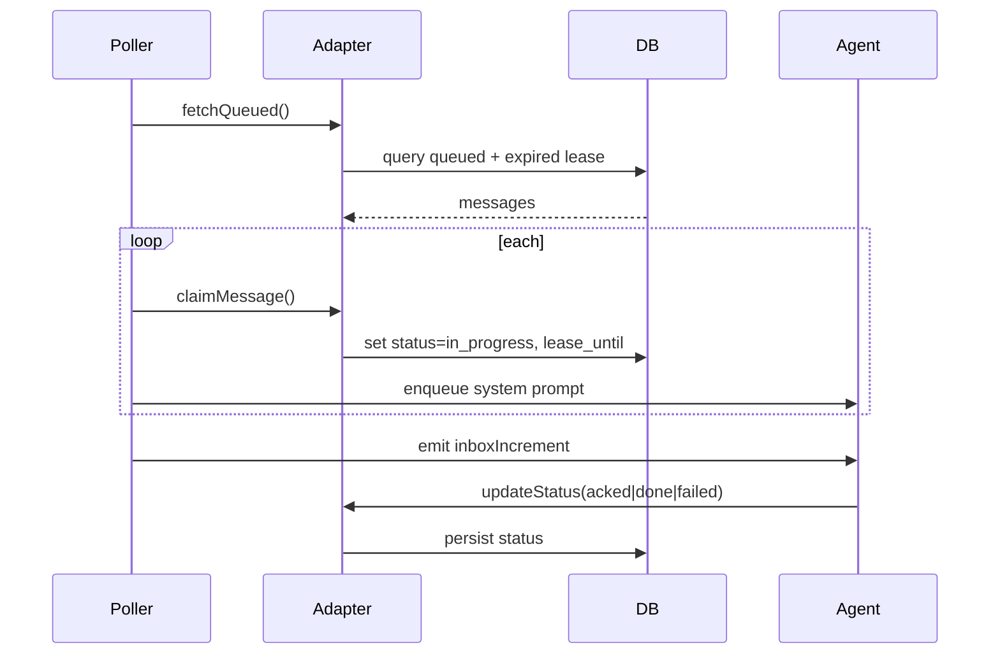

# Polling Module Contract (Fork-only)

Idle-only, opt-in poller that surfaces queued messages to the interactive agent via pluggable adapters (HTTP or Arango). Designed for fork-only use; upstream avoids background behavior.

## Architecture
```mermaid
flowchart LR
    subgraph Agent
        A1[Agent Core]
        A2[Poller]
        A3[/poll Commands]
    end
    subgraph Adapter
        D1[Arango]
        D2[HTTP]
    end
    subgraph DB
        MQ[(messages)]
    end

    A2 -->|fetchQueued| Adapter
    Adapter --> MQ
    MQ --> Adapter
    Adapter -->|claim/update| A2
    A2 -->|enqueue prompt| A1
    A3 -->|list/ack/done/failed| A2
```

## MUST
- Opt-in: enabled only if `settings.poller.enabled`.
- Idle-only: skip when `agent.state.isStreaming` is true.
- Lease set on claim; status moves to `in_progress`.
- Exponential backoff with capped delay; degraded/recovered notices.
- `/poll` lists id/type/from/status/correlation_id?/payload_ref? and supports `on/off/interval/ack/done/failed`.
- Adapter abstraction (`IDatabaseAdapter`); no `any`.
- Config validation up front (HTTP baseUrl; Arango url/database/messagesCollection).
- HTTP requests use per-request timeout to avoid hangs.
- Removable: deleting `src/poller/*` and wiring must not break other agent code.

## SHOULD
- Injected logger (falls back to console) for consistent logs.
- Event hook for inbox increments to update TUI status.
- Tests for backoff/degraded/recovered, dedup, claim/lease, status updates, HTTP timeout.

## MUST NOT
- Poll while streaming.
- Auto-ack/done without explicit action.
- Hard-wire DB logic into `poller.ts`.
- Use background bash loops.

## Lifecycle (simplified)


## Acceptance checklist
- Disabled safely when config absent.
- Idle gate verified.
- Lease + status set on claim.
- Backoff escalates; degraded then recovered logs once each.
- `/poll` commands work; inbox count updates.
- Config validation errors are explicit.
- No `any` introduced.
