# 📊 Complete Codebase Hook Reference Report

> Generated analysis for pattern: `hooks|hook`
> Search prompt: "find all references of hooks"
> 
> **Last Updated**: 2026-03-04
> **Total Hook Types Identified**: 90+

---

## 📑 Table of Contents

1. [Summary by Package](#summary-by-package)
2. [Extension Event Hooks (47 Events)](#extension-event-hooks-47-events)
3. [AI Package Streaming Events (10)](#ai-package-streaming-events-10)
4. [Agent Package Events (7)](#agent-package-events-7)
5. [Tool-Level Hooks](#tool-level-hooks)
6. [Web UI Callback Hooks (15+)](#web-ui-callback-hooks-15)
7. [TUI Component Callbacks (6)](#tui-component-callbacks-6)
8. [Session & Compaction Hooks](#session--compaction-hooks)
9. [Subagent Lifecycle Hooks (4)](#subagent-lifecycle-hooks-4)
10. [Legacy/Historical Hooks](#legacyhistorical-hooks)
11. [Architecture Visualization](#architecture-visualization)
12. [Usage Examples](#usage-examples)
13. [Best Practices](#best-practices)

---

## Summary by Package

| Package | Hook Type | Count | Location |
|:--------|:----------|:-----:|:---------|
| **coding-agent** | Extension Events | 47 | `src/core/extensions/types.ts` |
| **ai** | Streaming Events | 10 | `src/types.ts` |
| **agent** | Agent Events | 7 | `src/types.ts`, `src/proxy.ts` |
| **web-ui** | Component Callbacks | 15+ | `src/components/*.ts` |
| **tui** | Component Callbacks | 6 | `src/components/*.ts` |
| **coding-agent** | Tool Hooks | 2 | `src/core/tools/bash.ts` |
| **coding-agent** | Session Flags | 2 | `src/core/session-manager.ts` |
| **coding-agent** | Subagent Lifecycle | 4 | `addons-extensions/subagent.ts` |

---

## Extension Event Hooks (47 Events)

The pi coding agent has a comprehensive extension event system with **47 distinct event types** organized into categories. Extensions can subscribe to these events using `pi.on(event, handler)`.

**Location:** `packages/coding-agent/src/core/extensions/types.ts`

### 🗂️ Session Lifecycle Events (10 events)

| Event | Type | Can Block? | Description |
|:------|:-----|:----------:|:------------|
| `session_start` | Event | ❌ | Fired when a session starts |
| `session_before_switch` | Event | ✅ | Before switching to another session |
| `session_switch` | Event | ❌ | After switching sessions |
| `session_before_fork` | Event | ✅ | Before forking a session |
| `session_fork` | Event | ❌ | After forking a session |
| `session_before_compact` | Event | ✅ | Before compaction starts |
| `session_compact` | Event | ❌ | After compaction completes |
| `session_before_tree` | Event | ✅ | Before tree operations (can be cancelled) |
| `session_tree` | Event | ❌ | After tree operations |
| `session_shutdown` | Event | ❌ | When session shuts down |

**Use Cases:**
- Session backup/sync to external services
- Custom compaction strategies
- Session analytics and tracking
- Multi-session coordination

---

### 🤖 Agent Lifecycle Events (9 events)

| Event | Type | Can Block? | Description |
|:------|:-----|:----------:|:------------|
| `context` | Event | ✅ | Before each LLM call (can modify messages) |
| `before_agent_start` | Event | ✅ | After user submits prompt but before agent loop |
| `agent_start` | Event | ❌ | When agent loop starts |
| `agent_end` | Event | ❌ | When agent loop ends |
| `turn_start` | Event | ❌ | At the start of each turn |
| `turn_end` | Event | ❌ | At the end of each turn |
| `message_start` | Event | ❌ | When any message starts |
| `message_update` | Event | ❌ | During streaming with token updates |
| `message_end` | Event | ❌ | When message ends |

**Use Cases:**
- Custom message filtering/transformation
- Agent behavior analytics
- Token counting and budget management
- Custom streaming UI

---

### 🔧 Tool Execution Events (6 core + 14 variants)

| Event | Type | Can Block? | Description |
|:------|:-----|:----------:|:------------|
| `tool_execution_start` | Event | ❌ | Before tool executes |
| `tool_execution_update` | Event | ❌ | During tool execution with partial results |
| `tool_execution_end` | Event | ❌ | After tool finishes |
| `tool_call` | Event | ✅ | Before tool call (can block/modify) |
| `tool_result` | Event | ✅ | After tool result (can modify) |
| `user_bash` | Event | ✅ | When user runs bash via `!` or `!!` prefix |

**Tool-Specific Call Event Variants (8):**
- `BashToolCallEvent` - Bash tool invocation
- `ReadToolCallEvent` - File read operation
- `EditToolCallEvent` - File edit operation
- `WriteToolCallEvent` - File write operation
- `GrepToolCallEvent` - Grep search operation
- `FindToolCallEvent` - Find files operation
- `LsToolCallEvent` - Directory listing
- `CustomToolCallEvent` - Custom tool invocation

**Tool-Specific Result Event Variants (8):**
- `BashToolResultEvent`
- `ReadToolResultEvent`
- `EditToolResultEvent`
- `WriteToolResultEvent`
- `GrepToolResultEvent`
- `FindToolResultEvent`
- `LsToolResultEvent`
- `CustomToolResultEvent`

**Use Cases:**
- Tool execution logging
- Custom tool behavior modification
- Tool permission gates
- Result filtering/transformation

---

### 🎯 Input & Context Events (3 events)

| Event | Type | Can Block? | Description |
|:------|:-----|:----------:|:------------|
| `input` | Event | ✅ | When user input received (can transform/block) |
| `resources_discover` | Event | ❌ | When discovering resources |
| `context` | Event | ✅ | When building context for LLM |

**Input Event Responses:**
```typescript
type InputEventResult =
  | { action: "continue" }              // Pass through unchanged
  | { action: "transform"; text: string; images?: ImageContent[] }  // Transform input
  | { action: "handled" };              // Block input, already handled
```

**Use Cases:**
- Input validation and sanitization
- Custom command parsing
- Auto-expansion of abbreviations
- Context window optimization

---

### 🔄 Model Events (1 event)

| Event | Type | Can Block? | Description |
|:------|:-----|:----------:|:------------|
| `model_select` | Event | ❌ | When model changes |

**Model Select Sources:**
- `"set"` - Explicitly set via /model command
- `"cycle"` - Cycled via Ctrl+P
- `"restore"` - Restored from session

**Use Cases:**
- Model-specific behavior adaptation
- Status bar updates
- Model usage analytics

---

### 📦 Complete Extension Event List

```
SESSION EVENTS (10)
├── session_start
├── session_before_switch (blockable)
├── session_switch
├── session_before_fork (blockable)
├── session_fork
├── session_before_compact (blockable)
├── session_compact
├── session_before_tree (blockable)
├── session_tree
└── session_shutdown

AGENT EVENTS (9)
├── context (blockable)
├── before_agent_start (blockable)
├── agent_start
├── agent_end
├── turn_start
├── turn_end
├── message_start
├── message_update
└── message_end

TOOL EVENTS (6 core)
├── tool_execution_start
├── tool_execution_update
├── tool_execution_end
├── tool_call (blockable)
├── tool_result (blockable)
└── user_bash (blockable)

TOOL CALL VARIANTS (8)
├── BashToolCallEvent
├── ReadToolCallEvent
├── EditToolCallEvent
├── WriteToolCallEvent
├── GrepToolCallEvent
├── FindToolCallEvent
├── LsToolCallEvent
└── CustomToolCallEvent

TOOL RESULT VARIANTS (8)
├── BashToolResultEvent
├── ReadToolResultEvent
├── EditToolResultEvent
├── WriteToolResultEvent
├── GrepToolResultEvent
├── FindToolResultEvent
├── LsToolResultEvent
└── CustomToolResultEvent

INPUT/CONTEXT (3)
├── input (blockable)
├── resources_discover
└── context (blockable)

MODEL (1)
└── model_select

TOTAL: 47 event interfaces
```

---

## AI Package Streaming Events (10)

Low-level streaming events emitted by the LLM providers.

**Location:** `packages/ai/src/types.ts`

| Event | Description |
|:------|:------------|
| `start` | Message stream starts |
| `text_start` | Text content block starts |
| `text_delta` | Text content increment |
| `text_end` | Text content block ends |
| `thinking_start` | Thinking/reasoning block starts |
| `thinking_delta` | Thinking content increment |
| `thinking_end` | Thinking block ends |
| `toolcall_start` | Tool call starts |
| `toolcall_delta` | Tool call arguments increment |
| `toolcall_end` | Tool call complete |

**Type Definition:**
```typescript
export type AssistantMessageEvent =
	| { type: "start"; partial: AssistantMessage }
	| { type: "text_start"; contentIndex: number; partial: AssistantMessage }
	| { type: "text_delta"; contentIndex: number; delta: string; partial: AssistantMessage }
	| { type: "text_end"; contentIndex: number; content: string; partial: AssistantMessage }
	| { type: "thinking_start"; contentIndex: number; partial: AssistantMessage }
	| { type: "thinking_delta"; contentIndex: number; delta: string; partial: AssistantMessage }
	| { type: "thinking_end"; contentIndex: number; content: string; partial: AssistantMessage }
	| { type: "toolcall_start"; contentIndex: number; partial: AssistantMessage }
	| { type: "toolcall_delta"; contentIndex: number; delta: string; partial: AssistantMessage }
	| { type: "toolcall_end"; contentIndex: number; toolCall: ToolCall; partial: AssistantMessage };
```

---

## Agent Package Events (7)

Core agent loop events.

**Location:** `packages/agent/src/types.ts`

| Event | Description |
|:------|:------------|
| `agent_start` | Agent loop starts |
| `agent_end` | Agent loop ends with final messages |
| `turn_start` | A turn (one assistant response + tool calls) starts |
| `turn_end` | Turn ends with message and tool results |
| `message_start` | Message starts (user, assistant, or toolResult) |
| `message_update` | Streaming update (assistant messages only) |
| `message_end` | Message ends |

**Type Definition:**
```typescript
export type AgentEvent =
	// Agent lifecycle
	| { type: "agent_start" }
	| { type: "agent_end"; messages: AgentMessage[] }
	// Turn lifecycle
	| { type: "turn_start" }
	| { type: "turn_end"; message: AgentMessage; toolResults: ToolResultMessage[] }
	// Message lifecycle
	| { type: "message_start"; message: AgentMessage }
	| { type: "message_update"; message: AgentMessage; assistantMessageEvent: AssistantMessageEvent }
	| { type: "message_end"; message: AgentMessage };
```

---

## Tool-Level Hooks

### BashSpawnHook

Allows modification of bash command execution context before spawning.

**Location:** `packages/coding-agent/src/core/tools/bash.ts`

```typescript
export type BashSpawnHook = (context: BashSpawnContext) => BashSpawnContext;

export interface BashSpawnContext {
	command: string;
	cwd: string;
	env: NodeJS.ProcessEnv;
}

export interface BashToolOptions {
	commandPrefix?: string;
	spawnHook?: BashSpawnHook;
}
```

**Use Cases:**
- Source shell profiles (`.profile`, `.bashrc`)
- Set custom environment variables
- Command logging/auditing
- Security validation

**Example:**
```typescript
const bashTool = createBashTool(cwd, {
	spawnHook: ({ command, cwd, env }) => ({
		command: `source ~/.profile\n${command}`,
		cwd,
		env: { ...env, PI_SPAWN_HOOK: "1" },
	}),
});
```

---

### Command Prefix

Prepends a command prefix to every bash command.

```typescript
export interface BashToolOptions {
	commandPrefix?: string;  // e.g., "shopt -s expand_aliases"
}
```

**Use Cases:**
- Enable shell aliases
- Set shell options
- Configure environment

---

## Web UI Callback Hooks (15+)

Web component callbacks for the `@mariozechner/pi-web-ui` package.

**Location:** `packages/web-ui/src/components/*.ts`

### AgentInterface Component

| Callback | Signature | Description |
|:---------|:----------|:------------|
| `onApiKeyRequired` | `(provider: string) => Promise<boolean>` | Prompt for API key |
| `onBeforeSend` | `() => void \| Promise<void>` | Before sending message |
| `onBeforeToolCall` | `(toolName: string, args: any) => boolean \| Promise<boolean>` | Before tool execution (can block) |
| `onCostClick` | `() => void` | Cost display clicked |

### MessageEditor Component

| Callback | Signature | Description |
|:---------|:----------|:------------|
| `onInput` | `(value: string) => void` | Input text changed |
| `onSend` | `(input: string, attachments: Attachment[]) => void` | Send message |
| `onAbort` | `() => void` | Abort streaming |
| `onModelSelect` | `() => void` | Model selector clicked |
| `onThinkingChange` | `(level: "off" \| "minimal" \| "low" \| "medium" \| "high") => void` | Thinking level changed |
| `onFilesChange` | `(files: Attachment[]) => void` | Attachments changed |

### Input Component

| Callback | Signature | Description |
|:---------|:----------|:------------|
| `onInput` | `(e: Event) => void` | Input event |
| `onChange` | `(e: Event) => void` | Change event |
| `onKeyDown` | `(e: KeyboardEvent) => void` | Key down event |
| `onKeyUp` | `(e: KeyboardEvent) => void` | Key up event |

### AttachmentTile Component

| Callback | Signature | Description |
|:---------|:----------|:------------|
| `onDelete` | `() => void` | Delete attachment |

### CustomProviderCard Component

| Callback | Signature | Description |
|:---------|:----------|:------------|
| `onRefresh` | `(provider: CustomProvider) => void` | Refresh provider |
| `onEdit` | `(provider: CustomProvider) => void` | Edit provider |
| `onDelete` | `(provider: CustomProvider) => void` | Delete provider |

---

## TUI Component Callbacks (6)

Terminal UI component callbacks.

**Location:** `packages/tui/src/components/*.ts`

### Editor Component

| Callback | Signature | Description |
|:---------|:----------|:------------|
| `onSubmit` | `(text: string) => void` | Form submitted |
| `onChange` | `(text: string) => void` | Text changed |

### Input Component

| Callback | Signature | Description |
|:---------|:----------|:------------|
| `onSubmit` | `(value: string) => void` | Input submitted |
| `onEscape` | `() => void` | Escape key pressed |

### SelectList Component

| Callback | Signature | Description |
|:---------|:----------|:------------|
| `onSelect` | `(item: SelectItem) => void` | Item selected |
| `onCancel` | `() => void` | Selection cancelled |
| `onSelectionChange` | `(item: SelectItem) => void` | Selection changed |

### SettingsList Component

| Callback | Signature | Description |
|:---------|:----------|:------------|
| `onChange` | `(id: string, newValue: string) => void` | Setting changed |
| `onCancel` | `() => void` | Cancelled |

---

## Session & Compaction Hooks

### fromHook Flag

Boolean flag on session entries indicating source.

**Location:** `packages/coding-agent/src/core/session-manager.ts`

```typescript
export interface CompactionEntry<T = unknown> extends SessionEntryBase {
	type: "compaction";
	summary: string;
	details?: T;
	/** True if generated by an extension, undefined/false if pi-generated */
	fromHook?: boolean;
}

export interface BranchSummaryEntry<T = unknown> extends SessionEntryBase {
	type: "branch_summary";
	summary: string;
	details?: T;
	/** True if generated by an extension, false if pi-generated */
	fromHook?: boolean;
}
```

**Purpose:**
- Distinguishes extension-generated from pi-generated entries
- Important for compaction logic (file operations only extracted from pi-generated summaries)

**Methods Using fromHook:**
- `branchWithSummary(branchFromId, summary, details?, fromHook?)`
- `addCompactionEntry(firstKeptEntryId, tokensBefore, details?, fromHook?)`

---

## Subagent Lifecycle Hooks (4)

Subagent lifecycle events for coordination.

**Location:** `packages/coding-agent/addons-extensions/subagent.ts`

| Event | Description |
|:------|:------------|
| `start` | Subagent starts |
| `retry` | Subagent being retried |
| `error` | Subagent encountered error |
| `recovered` | Subagent recovered from error |

**Configuration Limits:**
- `MAX_AUTO_INGEST_RESULTS_PER_TURN` - Results auto-ingested per turn
- `MAX_AUTO_INGEST_LIFECYCLE_EVENTS_PER_TURN` - Lifecycle events auto-ingested

**Use Cases:**
- Batch pacing coordination
- Retry logic management
- Failure handling
- Subagent orchestration

---

## Legacy/Historical Hooks

### hookMessage (Deprecated)

A legacy message role that was renamed to `custom` in v3.

**Migration (v2 → v3):**
```typescript
if (msgEntry.message && 
    (msgEntry.message as { role: string }).role === "hookMessage") {
	(msgEntry.message as { role: string }).role = "custom";
}
```

---

### hooks/ Directory (Deprecated)

The `hooks/` directory was renamed to `extensions/`.

**Location:** `packages/coding-agent/src/migrations.ts`

```typescript
const hooksDir = join(baseDir, "hooks");
if (existsSync(hooksDir)) {
	warnings.push(
		`${label} hooks/ directory found. Hooks have been renamed to extensions.`
	);
}
```

---

## Architecture Visualization

```mermaid
graph TB
    subgraph "Extension Events (47)"
        EXT["pi.on() API"]
        SESSION["Session Events (10)"]
        AGENT_EVT["Agent Events (9)"]
        TOOL_EVT["Tool Events (6+14)"]
        INPUT_EVT["Input Events (3)"]
        MODEL_EVT["Model Events (1)"]
        
        EXT --> SESSION
        EXT --> AGENT_EVT
        EXT --> TOOL_EVT
        EXT --> INPUT_EVT
        EXT --> MODEL_EVT
    end
    
    subgraph "AI Package (10)"
        STREAM["AssistantMessageEvent"]
        TEXT["text_start/delta/end"]
        THINK["thinking_start/delta/end"]
        TOOL_STREAM["toolcall_start/delta/end"]
        
        STREAM --> TEXT
        STREAM --> THINK
        STREAM --> TOOL_STREAM
    end
    
    subgraph "Agent Package (7)"
        AGENT_CORE["AgentEvent"]
        AGENT_LC["agent_start/end"]
        TURN_LC["turn_start/end"]
        MSG_LC["message_start/update/end"]
        
        AGENT_CORE --> AGENT_LC
        AGENT_CORE --> TURN_LC
        AGENT_CORE --> MSG_LC
    end
    
    subgraph "Tool Hooks (2)"
        SPAWN["BashSpawnHook"]
        PREFIX["commandPrefix"]
    end
    
    subgraph "Web UI (15+)"
        WEB_IFACE["AgentInterface"]
        WEB_EDITOR["MessageEditor"]
        WEB_INPUT["Input"]
        
        WEB_IFACE --> onSend["onBeforeSend"]
        WEB_IFACE --> onTool["onBeforeToolCall"]
        WEB_EDITOR --> onSend2["onSend"]
        WEB_EDITOR --> onAbort["onAbort"]
        WEB_INPUT --> onKey["onKeyDown/Up"]
    end
    
    subgraph "TUI (6)"
        TUI_EDITOR["Editor"]
        TUI_INPUT["Input"]
        TUI_SELECT["SelectList"]
        
        TUI_EDITOR --> onChange["onChange"]
        TUI_INPUT --> onEscape["onEscape"]
        TUI_SELECT --> onSelect["onSelect"]
    end
    
    subgraph "Subagent (4)"
        SUB_LC["Lifecycle"]
        SUB_START["start"]
        SUB_RETRY["retry"]
        SUB_ERROR["error"]
        SUB_RECOVER["recovered"]
        
        SUB_LC --> SUB_START
        SUB_LC --> SUB_RETRY
        SUB_LC --> SUB_ERROR
        SUB_LC --> SUB_RECOVER
    end
```



---

## Usage Examples

### Example 1: Subscribe to All Tool Calls

```typescript
export default function (pi: ExtensionAPI) {
	// Listen to all tool calls
	pi.on("tool_call", async (event, ctx) => {
		console.log(`Tool called: ${event.toolName}`, event.input);
		return { action: "continue" };
	});
	
	// Listen to specific tool types
	pi.on("tool_call", async (event, ctx) => {
		if (event.toolName === "bash") {
			const bashEvent = event as BashToolCallEvent;
			console.log("Bash command:", bashEvent.input.command);
		}
		return { action: "continue" };
	});
}
```

---

### Example 2: Transform Input with Validation

```typescript
export default function (pi: ExtensionAPI) {
	pi.on("input", async (event, ctx) => {
		const { text, images, source } = event;
		
		// Block empty input
		if (!text.trim()) {
			ctx.ui.notify("Input cannot be empty", "warning");
			return { action: "handled" };
		}
		
		// Transform abbreviations
		const transformed = text
			.replace(/\bpls\b/g, "please")
			.replace(/\bthx\b/g, "thanks");
		
		if (transformed !== text) {
			return { action: "transform", text: transformed, images };
		}
		
		return { action: "continue" };
	});
}
```

---

### Example 3: Custom Compaction Strategy

```typescript
export default function (pi: ExtensionAPI) {
	pi.on("session_before_compact", async (event, ctx) => {
		const { preparation } = event;
		
		// Override compaction with custom logic
		preparation.customInstructions = `
			Preserve all file paths and edit operations.
			Summarize conversation history concisely.
			Keep error messages verbatim.
		`;
		preparation.replaceInstructions = false;
	});
}
```

---

### Example 4: BashSpawnHook for Environment

```typescript
export default function (pi: ExtensionAPI) {
	const bashTool = createBashTool(process.cwd(), {
		commandPrefix: "shopt -s expand_aliases",
		spawnHook: ({ command, cwd, env }) => ({
			command: `source ~/.bashrc\n${command}`,
			cwd,
			env: { ...env, NODE_ENV: "development" },
		}),
	});
	
	pi.tools.add(bashTool);
}
```

---

### Example 5: Web UI Integration

```typescript
// In your web app
const chatPanel = new ChatPanel(agent, {
	onApiKeyRequired: async (provider) => {
		const key = prompt(`Enter API key for ${provider}:`);
		return !!key;
	},
	onBeforeSend: async () => {
		console.log("Sending message...");
	},
	onBeforeToolCall: (toolName, args) => {
		if (toolName === "bash" && args.command.includes("rm")) {
			return confirm("Allow destructive command?");
		}
		return true;
	},
	onCostClick: () => {
		console.log("Cost clicked");
	},
});
```

---

## Best Practices

### 1. Choose the Right Hook Layer

| Goal | Recommended Layer |
|:-----|:------------------|
| User input transformation | `input` event |
| Message filtering | `context` event |
| Tool execution monitoring | `tool_execution_*` events |
| Tool call modification | `tool_call` event |
| LLM streaming control | AI package events |
| UI component behavior | TUI/Web UI callbacks |

### 2. Blocking vs Non-Blocking

- **Use blocking** when you need to modify data or prevent actions
- **Use non-blocking** for logging, monitoring, side effects

### 3. Error Handling

```typescript
pi.on("tool_call", async (event, ctx) => {
	try {
		// Your logic
		return { action: "continue" };
	} catch (error) {
		console.error("Extension error:", error);
		return { action: "continue" }; // Don't block on errors
	}
});
```

### 4. Performance

- Avoid heavy computation in synchronous paths
- Use async for I/O operations
- Be mindful of streaming event frequency

---

## Quick Reference Card

```
╔══════════════════════════════════════════════════════════════╗
║                    PI HOOK REFERENCE                         ║
╠══════════════════════════════════════════════════════════════╣
║ EXTENSION EVENTS (47)                                        ║
║ ├── Session (10): session_start, session_before_switch,     ║
║ │   session_switch, session_before_fork, session_fork,      ║
║ │   session_before_compact, session_compact,                ║
║ │   session_before_tree, session_tree, session_shutdown     ║
║ ├── Agent (9): context, before_agent_start, agent_start,    ║
║ │   agent_end, turn_start, turn_end, message_start,         ║
║ │   message_update, message_end                              ║
║ ├── Tool (6): tool_execution_start/update/end,              ║
║ │   tool_call, tool_result, user_bash                       ║
║ ├── Input (3): input, resources_discover, context           ║
║ └── Model (1): model_select                                 ║
╠══════════════════════════════════════════════════════════════╣
║ AI STREAMING (10)                                            ║
║ └── start, text_start/delta/end, thinking_start/delta/end,  ║
║     toolcall_start/delta/end                                 ║
╠══════════════════════════════════════════════════════════════╣
║ AGENT EVENTS (7)                                             ║
║ └── agent_start/end, turn_start/end, message_start/update/end║
╠══════════════════════════════════════════════════════════════╣
║ TOOL HOOKS (2)                                               ║
║ └── BashSpawnHook, commandPrefix                             ║
╠══════════════════════════════════════════════════════════════╣
║ WEB UI CALLBACKS (15+)                                       ║
║ └── onBeforeSend, onBeforeToolCall, onApiKeyRequired,       ║
║     onCostClick, onSend, onAbort, onModelSelect, etc.       ║
╠══════════════════════════════════════════════════════════════╣
║ TUI CALLBACKS (6)                                            ║
║ └── onSubmit, onChange, onCancel, onSelect, onEscape,       ║
║     onSelectionChange                                        ║
╠══════════════════════════════════════════════════════════════╣
║ SUBAGENT LIFECYCLE (4)                                       ║
║ └── start, retry, error, recovered                           ║
╠══════════════════════════════════════════════════════════════╣
║ SESSION FLAGS (2)                                            ║
║ └── fromHook, hookMessage (legacy)                           ║
╚══════════════════════════════════════════════════════════════╝
```

---

## Files Reference

| Category | File Path |
|:---------|:----------|
| Extension Types | `packages/coding-agent/src/core/extensions/types.ts` |
| AI Streaming | `packages/ai/src/types.ts` |
| Agent Events | `packages/agent/src/types.ts` |
| Bash Tool | `packages/coding-agent/src/core/tools/bash.ts` |
| Session Manager | `packages/coding-agent/src/core/session-manager.ts` |
| Subagent | `packages/coding-agent/addons-extensions/subagent.ts` |
| Web UI AgentInterface | `packages/web-ui/src/components/AgentInterface.ts` |
| Web UI MessageEditor | `packages/web-ui/src/components/MessageEditor.ts` |
| TUI Editor | `packages/tui/src/components/editor.ts` |
| TUI Input | `packages/tui/src/components/input.ts` |
| TUI SelectList | `packages/tui/src/components/select-list.ts` |

---

*Report generated automatically by scanning the pi-mono codebase.*
*Total hooks identified: 90+*
