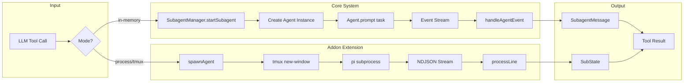
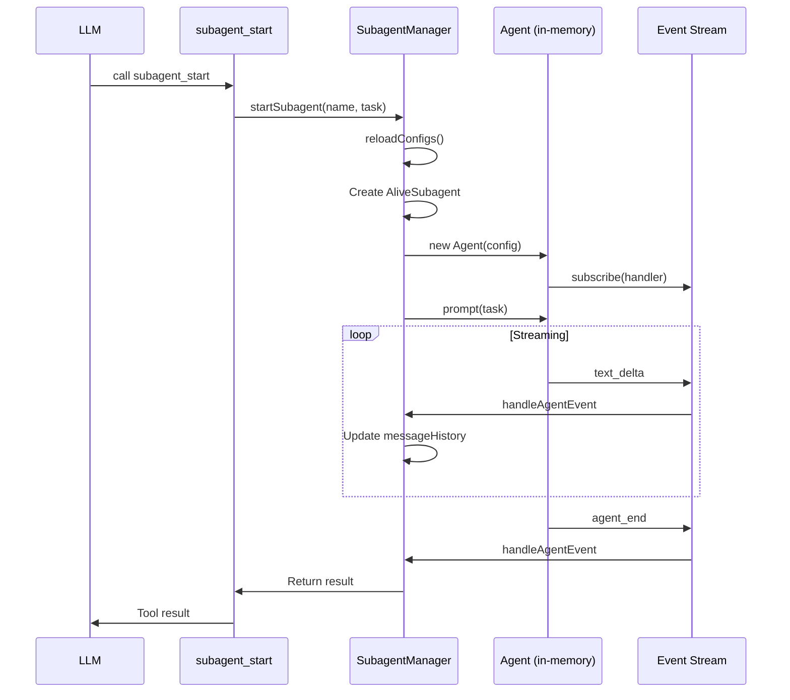
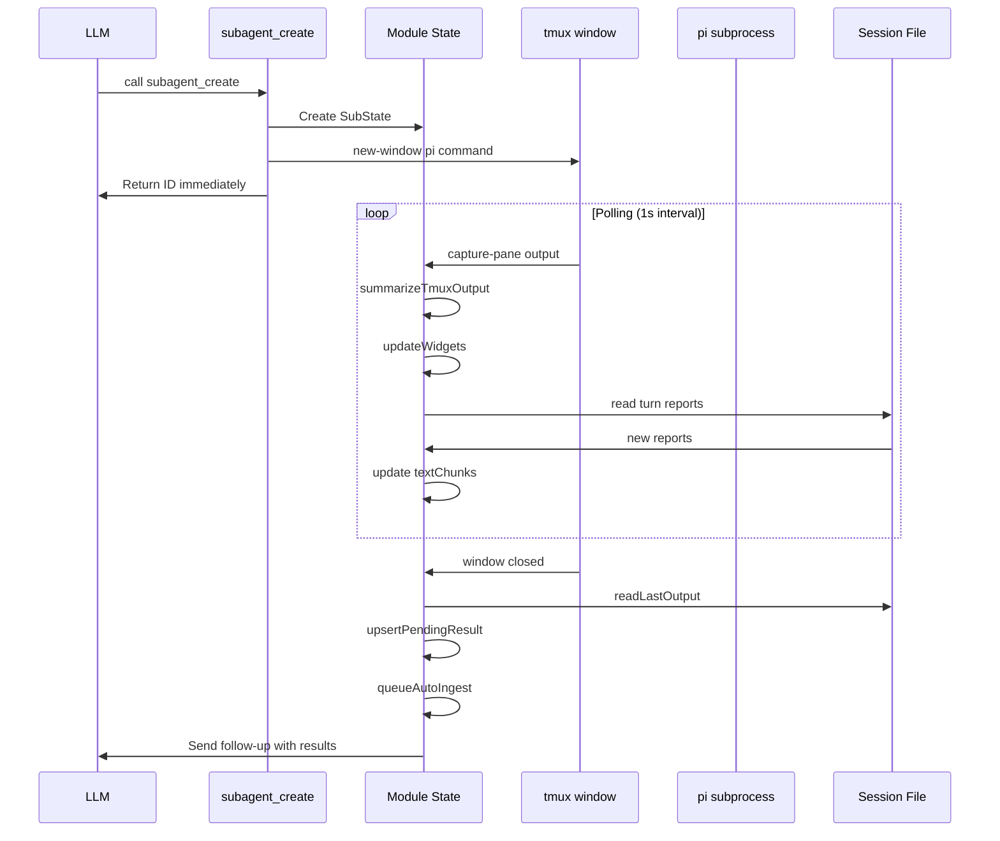
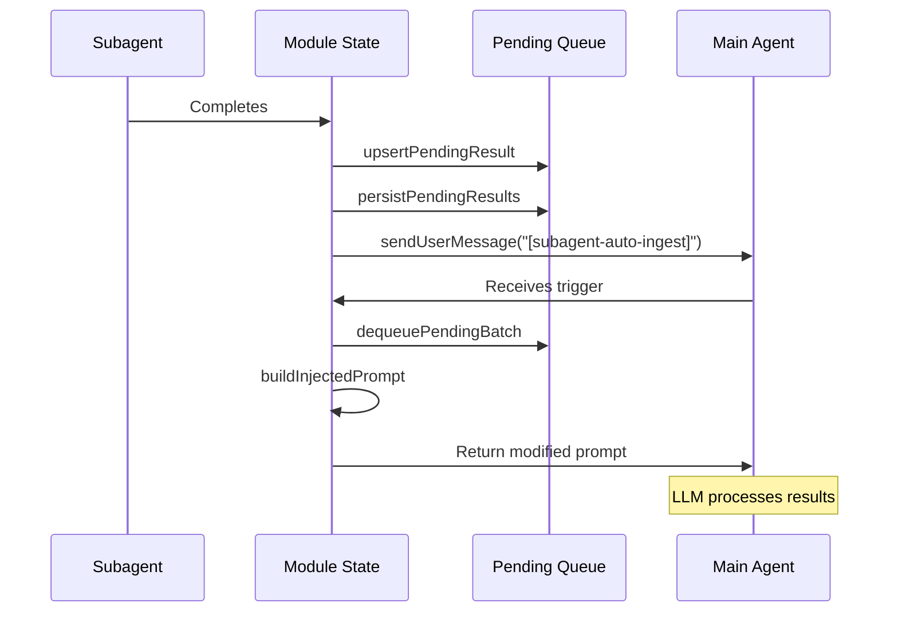

# 📊 Codebase Reference Report: Subagent System

> Generated analysis for pattern: `subagent`
> Search prompt: "Find all references related to subagents, teams, and agent architecture"
> Branch: `PiZ/subagents-bease-team`
> Last Updated: 2026-03-04

---

## Table of Contents

1. [Quick Summary](#-quick-summary)
2. [Architecture Visualization](#-architecture-visualization)
3. [Configuration Constants](#-configuration-constants)
4. [Detailed Reference Analysis](#-detailed-reference-analysis)
5. [Two Implementation Approaches](#-two-implementation-approaches)
6. [Execution Flow Diagrams](#-execution-flow-diagrams)
7. [Error Handling & Retry Logic](#-error-handling--retry-logic)
8. [Session & State Management](#-session--state-management)
9. [Widget System](#-widget-system)
10. [Orchestrator Mode](#-orchestrator-mode)
11. [Auto-Ingest Mechanism](#-auto-ingest-mechanism)
12. [Tool Parameter Schemas](#-tool-parameter-schemas)
13. [Cross-Reference Matrix](#-cross-reference-matrix)
14. [Impact Analysis](#-impact-analysis)
15. [Notes & Recommendations](#-notes--recommendations)

---

## 📋 Quick Summary

| # | File | Line | Entity | Type | Brief Description |
|:-:|:-----|:----:|:-------|:-----|:------------------|
| 1 | `packages/coding-agent/src/core/subagents/types.ts` | 1 | `SubagentConfig` | interface | Core configuration for subagent definitions |
| 2 | `packages/coding-agent/src/core/subagents/types.ts` | 73 | `AliveSubagent` | interface | Runtime state for an active subagent instance |
| 3 | `packages/coding-agent/src/core/subagents/manager.ts` | 31 | `SubagentManager` | class | Central registry and lifecycle manager |
| 4 | `packages/coding-agent/src/core/subagents/discovery.ts` | 47 | `discoverAgents` | function | Discovers agents from user/project/builtin sources |
| 5 | `packages/coding-agent/src/core/subagents/parser.ts` | 54 | `parseAgentFile` | function | Parses markdown agent definitions with frontmatter |
| 6 | `packages/coding-agent/src/core/subagents/tools.ts` | 18 | `registerSubagentTools` | function | Registers LLM-callable subagent tools |
| 7 | `packages/coding-agent/src/core/subagents/commands.ts` | 11 | `registerSubagentCommands` | function | Registers slash commands for user interaction |
| 8 | `packages/coding-agent/addons-extensions/subagent.ts` | 1 | `subagent_create` | tool | Background subagent spawning (tmux-based) |
| 9 | `packages/coding-agent/examples/extensions/subagent/index.ts` | 1 | `subagent` | tool | Example extension with single/parallel/chain modes |
| 10 | `packages/coding-agent/src/core/subagents/builtins/scout.md` | 1 | `scout` | agent | Fast codebase recon agent |
| 11 | `packages/coding-agent/src/core/subagents/builtins/planner.md` | 1 | `planner` | agent | Implementation planning agent |
| 12 | `packages/coding-agent/src/core/subagents/builtins/worker.md` | 1 | `worker` | agent | General-purpose autonomous agent |

---

## 🗺️ Architecture Visualization

### High-Level System Architecture

```mermaid
graph TD
    subgraph "Core Subagent System"
        SM[SubagentManager] --> |manages| AS[AliveSubagent]
        SM --> |loads| SC[SubagentConfig]
        SM --> |discovers| DIS[discoverAgents]
        DIS --> |parses| P[parseAgentFile]
        P --> |reads| MD[*.md Agent Files]
        
        TOOLS[registerSubagentTools] --> |uses| SM
        CMDS[registerSubagentCommands] --> |uses| SM
    end
    
    subgraph "Agent Sources"
        DIS --> |user| UA[~/.pi/agent/agents/]
        DIS --> |project| PA[.pi/agent/agents/]
        DIS --> |builtin| BA[src/core/subagents/builtins/]
    end
    
    subgraph "Built-in Agents"
        BA --> SCOUT[scout.md]
        BA --> PLANNER[planner.md]
        BA --> WORKER[worker.md]
    end
    
    subgraph "Tool Implementations"
        TOOLS --> SST[subagent_start]
        TOOLS --> SW[subagent_wait]
        TOOLS --> SSND[subagent_send]
        TOOLS --> SL[subagent_list]
        TOOLS --> SSTOP[subagent_stop]
    end
    
    subgraph "Slash Commands"
        CMDS --> AGENTS[/agents]
        CMDS --> AGENT[/agent]
        CMDS --> ASEND[/agent-send]
        CMDS --> AOUT[/agent-output]
        CMDS --> AKILL[/agent-kill]
        CMDS --> ACONF[/agent-list-configs]
    end
    
    subgraph "Extension Variants"
        EXT1[addons-extensions/subagent.ts]
        EXT2[examples/extensions/subagent/]
        EXT1 --> |spawns| PI[pi subprocess]
        EXT2 --> |spawns| PI
    end
    
    AS --> |in-memory| AGENT[Agent from pi-agent-core]
    AS --> |process| PI
```

### Data Flow Diagram



---

## 🔧 Configuration Constants

### Core System Constants (types.ts)

```typescript
// Status states for subagent lifecycle
export type SubagentStatus =
  | "starting"    // Process/agent is being initialized
  | "idle"        // Ready for input
  | "running"     // Currently processing
  | "waiting-input" // Waiting for user/parent input
  | "done"        // Task completed
  | "error"       // Error state
  | "stopped";    // Manually stopped

// Execution modes
export type SubagentMode = "in-memory" | "process";

// Memory persistence scopes
export type MemoryScope = "none" | "user" | "project";

// Agent definition sources
export type SubagentSource = "user" | "project" | "builtin";
```

### Addon Extension Constants (addons-extensions/subagent.ts)

```typescript
// Result/Event queue limits
const MAX_PENDING_RESULT_CHARS = 4_000;        // Max chars per pending result
const MAX_INJECTED_RESULT_CHARS = 2_000;       // Max chars when injecting into prompt
const MAX_PENDING_RESULTS_QUEUE = 32;          // Max queued results
const MAX_PENDING_LIFECYCLE_QUEUE = 128;       // Max queued lifecycle events
const MAX_AUTO_INGEST_RESULTS_PER_TURN = 2;    // Results per auto-ingest batch
const MAX_AUTO_INGEST_LIFECYCLE_EVENTS_PER_TURN = 8;

// Concurrency limits
const MAX_MAIN_AGENT_RUNNING_SUBAGENTS = 6;    // Max concurrent main-agent subagents
const MAX_TRACKED_SUBAGENTS = 40;               // Max tracked subagent entries

// Retry configuration
const START_ACTIVITY_TIMEOUT_MS = 45_000;      // 45s startup timeout
const SUBAGENT_MAX_RETRIES = 10;                // Max retry attempts
const SUBAGENT_RETRY_DELAYS_SECONDS = [5, 15, 30, 15, 30, 15, 30, 15, 30, 15];

// Thinking levels
const VALID_THINKING_LEVELS: ReadonlySet<ThinkingLevel> = 
  new Set(["off", "minimal", "low", "medium", "high", "xhigh"]);
const DEFAULT_SUBAGENT_THINKING: ThinkingLevel = "high";

// Dispatch tools for orchestrator mode
const DISPATCH_TOOL_NAMES = ["task", "subagent_create"] as const;
```

### Example Extension Constants (examples/extensions/subagent/index.ts)

```typescript
const MAX_PARALLEL_TASKS = 8;    // Max parallel tasks in parallel mode
const MAX_CONCURRENCY = 4;        // Max concurrent executions
const COLLAPSED_ITEM_COUNT = 10; // Items shown in collapsed view
```

---

## 📑 Detailed Reference Analysis

### Reference #1: `types.ts` - Core Type Definitions

| Field | Value |
|:------|:------|
| **@file_path** | `packages/coding-agent/src/core/subagents/types.ts` |
| **@lineno** | 1 |
| **@entity_name** | `SubagentConfig`, `AliveSubagent`, `SubagentManagerConfig` |
| **@entity_type** | interface |

#### 📝 @description

Defines all TypeScript types for the subagent system. This is the foundational type file that all other subagent modules depend on.

**SubagentConfig** - Parsed agent definition from markdown files:
```typescript
export interface SubagentConfig {
  name: string;              // Agent name (unique identifier)
  description: string;       // Description shown to LLM for delegation decisions
  systemPrompt: string;      // System prompt for the subagent
  tools?: string[];          // Allowed tool names (undefined = all tools)
  model?: string;            // Preferred model ID (e.g., "claude-haiku-4-5")
  thinking?: ThinkingLevel;  // Preferred thinking level
  memory?: MemoryScope;      // Memory persistence setting
  source: SubagentSource;    // Source of the definition
  filePath: string;          // File path of the definition
}
```

**AliveSubagent** - Runtime state for an active subagent instance:
```typescript
export interface AliveSubagent {
  // Identity
  id: string;                    // Unique instance ID (short UUID)
  name: string;                  // Agent type name (e.g., "scout")
  config: SubagentConfig;        // Full configuration

  // Execution
  mode: SubagentMode;            // Execution mode
  status: SubagentStatus;        // Current status
  task: string;                  // Original task string
  cwd: string;                   // Working directory

  // State (in-memory mode)
  agent?: Agent;                 // Agent instance (for in-memory mode)
  tools?: AgentTool[];           // Tool instances for this subagent
  model?: Model<Api>;            // Model configuration
  thinkingLevel?: ThinkingLevel; // Thinking level

  // State (process mode)
  process?: ChildProcess;        // Child process (for process mode)
  rpcClient?: RpcClientLike;     // RPC client (for process mode)

  // Communication
  pendingMessages: SubagentMessage[];  // Pending messages to be processed
  messageHistory: SubagentMessage[];   // All message history
  unsubscribe?: () => void;            // Unsubscribe function for agent events

  // Metrics
  startTime: number;             // Start timestamp
  lastActivity: number;          // Last activity timestamp
  usage: SubagentUsage;          // Token usage
  turnCount: number;             // Number of turns completed

  // Memory
  memoryContent?: string;        // Memory content loaded
  memoryFile?: string;           // Memory file path

  // Abort
  abortController?: AbortController; // Abort controller for cancellation
}
```

**SubagentUsage** - Token usage metrics:
```typescript
export interface SubagentUsage {
  inputTokens: number;
  outputTokens: number;
  cacheReadTokens: number;
  cacheWriteTokens: number;
  totalCost: number;
}
```

**SubagentMessage** - Message structure:
```typescript
export interface SubagentMessage {
  id: string;                              // Unique message ID
  subagentId: string;                      // Subagent instance ID
  role: "user" | "assistant" | "system" | "toolResult";
  content: string;                         // Message content
  timestamp: number;                       // Timestamp
  source: "parent" | "user" | "self";      // Source of the message
}
```

#### 🔗 @relations

| Relation Type | Related Entity | File | Line | Description |
|:--------------|:---------------|:-----|:----:|:------------|
| **used_by** | `SubagentManager` | manager.ts | 31 | Uses these types for all operations |
| **used_by** | `registerSubagentTools` | tools.ts | 18 | Uses types for tool parameters |
| **used_by** | `discoverAgents` | discovery.ts | 47 | Returns DiscoveryResult type |
| **imports** | `Agent`, `AgentTool`, `ThinkingLevel` | @mariozechner/pi-agent-core | - | Core agent types |
| **imports** | `Api`, `Model` | @mariozechner/pi-ai | - | AI provider types |

---

### Reference #2: `manager.ts` - SubagentManager Class

| Field | Value |
|:------|:------|
| **@file_path** | `packages/coding-agent/src/core/subagents/manager.ts` |
| **@lineno** | 31 |
| **@entity_name** | `SubagentManager` |
| **@entity_type** | class |

#### 📝 @description

Central registry and lifecycle manager for alive subagents. This class is the heart of the core subagent system.

**Key Methods:**

```typescript
export class SubagentManager {
  private subagents = new Map<string, AliveSubagent>();
  private configs = new Map<string, SubagentConfig>();
  private listeners = new Set<SubagentManagerEventHandler>();
  private config: SubagentManagerConfig;
  private activeSubagentId: string | undefined;
  private cwd: string;

  // ========================================
  // Lifecycle Methods
  // ========================================

  /**
   * Start a new subagent.
   * @param name - Agent name (e.g., "scout", "planner")
   * @param task - Task for the subagent to execute
   * @param options - Start options (mode, cwd, waitForResult, timeout, context)
   */
  async startSubagent(
    name: string, 
    task: string, 
    options: StartSubagentOptions = {}
  ): Promise<StartSubagentResult>;

  /**
   * Stop a subagent.
   */
  async stopSubagent(id: string): Promise<void>;

  /**
   * Stop all subagents.
   */
  async stopAllSubagents(): Promise<void>;

  /**
   * Dispose of the manager and all subagents.
   */
  async dispose(): Promise<void>;

  // ========================================
  // Communication Methods
  // ========================================

  /**
   * Send a message to a subagent.
   */
  async sendToSubagent(id: string, message: string): Promise<void>;

  /**
   * Get subagent output.
   */
  async getSubagentOutput(id: string): Promise<SubagentOutput>;

  /**
   * Wait for subagent to complete.
   */
  async waitForCompletion(id: string, timeout?: number): Promise<void>;

  // ========================================
  // Query Methods
  // ========================================

  getSubagent(id: string): AliveSubagent | undefined;
  listSubagents(filter?: SubagentFilter): AliveSubagent[];
  getActiveSubagent(): string | undefined;
  setActiveSubagent(id: string | undefined): void;
  getAvailableAgents(): SubagentConfig[];
  getAgentConfig(name: string): SubagentConfig | undefined;

  // ========================================
  // Event Methods
  // ========================================

  on(handler: SubagentManagerEventHandler): () => void;
  off(handler: SubagentManagerEventHandler): void;
  private emit(event: SubagentManagerEvent): void;
}
```

**startSubagent Implementation Flow:**

```typescript
async startSubagent(name: string, task: string, options: StartSubagentOptions = {}): Promise<StartSubagentResult> {
  // 1. Reload configs to pick up newly added agent files
  this.reloadConfigs();

  // 2. Validate agent exists
  const config = this.configs.get(name);
  if (!config) {
    const available = Array.from(this.configs.keys()).join(", ") || "none";
    throw new Error(`Unknown agent: "${name}". Available agents: ${available}`);
  }

  // 3. Check concurrent limit
  const active = Array.from(this.subagents.values()).filter(
    (s) => s.status !== "done" && s.status !== "error" && s.status !== "stopped",
  );
  const maxConcurrent = this.config.maxConcurrent ?? 4;
  if (active.length >= maxConcurrent) {
    throw new Error(`Maximum concurrent subagents reached (${maxConcurrent})`);
  }

  // 4. Create subagent instance
  const id = this.generateId();
  const subagent: AliveSubagent = {
    id, name, config,
    mode: options.mode ?? this.config.defaultMode ?? "in-memory",
    status: "starting",
    task,
    cwd: options.cwd ?? this.cwd,
    pendingMessages: [],
    messageHistory: [],
    startTime: Date.now(),
    lastActivity: Date.now(),
    usage: { inputTokens: 0, outputTokens: 0, cacheReadTokens: 0, cacheWriteTokens: 0, totalCost: 0 },
    turnCount: 0,
    abortController: new AbortController(),
  };

  // 5. Start execution
  this.subagents.set(id, subagent);
  this.emit({ type: "started", subagent });

  // 6. Launch based on mode
  if (mode === "in-memory") {
    await this.startInMemory(subagent, task, options);
  } else {
    throw new Error("Process-based subagents not yet implemented. Use mode: 'in-memory'");
  }

  // 7. Wait for completion if requested
  const shouldWait = options.waitForResult ?? mode === "in-memory";
  if (shouldWait && subagent.status !== "done") {
    await this.waitForCompletion(id, options.timeout);
  }

  return {
    id,
    status: subagent.status,
    complete: subagent.status === "done",
    output: this.getLastOutput(subagent),
    usage: subagent.usage,
  };
}
```

#### 🔗 @relations

| Relation Type | Related Entity | File | Line | Description |
|:--------------|:---------------|:-----|:----:|:------------|
| **imports** | `Agent` | @mariozechner/pi-agent-core | - | Creates in-memory agent instances |
| **imports** | `discoverAgents` | discovery.ts | 47 | Loads agent configurations |
| **used_by** | `registerSubagentTools` | tools.ts | 18 | Tools use manager for operations |
| **used_by** | `registerSubagentCommands` | commands.ts | 11 | Commands use manager for queries |

---

### Reference #3: `discovery.ts` - Agent Discovery

| Field | Value |
|:------|:------|
| **@file_path** | `packages/coding-agent/src/core/subagents/discovery.ts` |
| **@lineno** | 47 |
| **@entity_name** | `discoverAgents` |
| **@entity_type** | function |

#### 📝 @description

Discovers all available agents from three sources (in priority order):

```typescript
export function discoverAgents(cwd: string): DiscoveryResult {
  // 1. Built-in agents (shipped with pi)
  const builtinAgents = loadAgentsFromDir(BUILTIN_AGENTS_DIR, "builtin");

  // 2. User agents: ~/.pi/agent/agents/
  const userAgentsDir = path.join(getAgentDir(), "agents");
  const userAgents = loadAgentsFromDir(userAgentsDir, "user");

  // 3. Project agents: .pi/agents/ (nearest to cwd)
  const projectAgentsDir = findProjectAgentsDir(cwd);
  const projectAgents = projectAgentsDir 
    ? loadAgentsFromDir(projectAgentsDir, "project") 
    : [];

  // Merge agents (project > user > builtin)
  const agentMap = new Map<string, SubagentConfig>();
  for (const agent of builtinAgents) agentMap.set(agent.name, agent);
  for (const agent of userAgents) agentMap.set(agent.name, agent);
  for (const agent of projectAgents) agentMap.set(agent.name, agent);

  return {
    agents: Array.from(agentMap.values()),
    userAgentsDir: isDirectory(userAgentsDir) ? userAgentsDir : null,
    projectAgentsDir,
    builtinAgentsDir: BUILTIN_AGENTS_DIR,
  };
}
```

**Project Directory Discovery:**

```typescript
function findProjectAgentsDir(cwd: string): string | null {
  let current = cwd;

  while (true) {
    // Check both modern and compatibility paths
    const candidates = [
      path.join(current, ".pi", "agent", "agents"),
      path.join(current, ".pi", "agents")
    ];
    
    for (const candidate of candidates) {
      try {
        if (fs.existsSync(candidate) && fs.statSync(candidate).isDirectory()) {
          return candidate;
        }
      } catch { /* Ignore errors */ }
    }

    const parent = path.dirname(current);
    if (parent === current) return null; // Reached root
    current = parent;
  }
}
```

---

### Reference #4: `parser.ts` - Agent File Parser

| Field | Value |
|:------|:------|
| **@file_path** | `packages/coding-agent/src/core/subagents/parser.ts` |
| **@lineno** | 54 |
| **@entity_name** | `parseAgentFile` |
| **@entity_type** | function |

#### 📝 @description

Parses markdown files with YAML frontmatter:

```typescript
export function parseAgentFile(
  content: string, 
  filePath: string, 
  source: SubagentSource
): SubagentConfig | null {
  const { frontmatter, body } = parseFrontmatter<AgentFrontmatter>(content);

  // Required fields
  if (!frontmatter.name || !frontmatter.description) {
    return null;
  }

  // Parse tools (comma-separated string to array, or array from YAML)
  let tools: string[] | undefined;
  if (frontmatter.tools) {
    if (typeof frontmatter.tools === "string") {
      tools = frontmatter.tools
        .split(",")
        .map((s) => s.trim())
        .filter(Boolean);
    } else if (Array.isArray(frontmatter.tools)) {
      tools = frontmatter.tools
        .map((s) => String(s).trim())
        .filter((s): s is string => Boolean(s));
    }
    if (tools && tools.length === 0) {
      tools = undefined; // Empty array = use all tools
    }
  }

  return {
    name: frontmatter.name,
    description: frontmatter.description,
    systemPrompt: body.trim(),
    tools,
    model: frontmatter.model,
    thinking: parseThinkingLevel(frontmatter.thinking),
    memory: frontmatter.memory ?? "none",
    source,
    filePath,
  };
}
```

**Frontmatter Format:**
```markdown
---
name: scout
description: Fast codebase recon that returns compressed context for handoff
tools: read, grep, find, ls, bash
model: claude-haiku-4-5
thinking: high
memory: none
---
[System prompt body - markdown content]
```

---

### Reference #5: `tools.ts` - LLM Tool Registration

| Field | Value |
|:------|:------|
| **@file_path** | `packages/coding-agent/src/core/subagents/tools.ts` |
| **@lineno** | 18 |
| **@entity_name** | `registerSubagentTools` |
| **@entity_type** | function |

#### 📝 @description

Registers 5 tools for the LLM to delegate work. Each tool includes custom renderers for call and result display.

**Tool Registration Pattern:**

```typescript
export function registerSubagentTools(pi: ExtensionAPI, manager: SubagentManager): void {
  // subagent_start - Start a new subagent (non-blocking)
  pi.registerTool({
    name: "subagent_start",
    label: "Start Subagent",
    description: [
      "Start a specialized subagent that runs in the background (non-blocking).",
      "Returns immediately with a subagent ID.",
      "Results are delivered to the main window when the subagent completes.",
      "Use subagent_wait to block until completion, or subagent_list to check status.",
      "Available agents: scout (fast recon), planner (implementation plans), worker (full capabilities).",
    ].join(" "),
    parameters: Type.Object({
      agent: Type.String({
        description: "Agent name: 'scout' (fast recon), 'planner' (planning), 'worker' (general purpose)",
      }),
      task: Type.String({ description: "Task for the subagent to execute" }),
    }),

    async execute(_toolCallId, params, _signal, _onUpdate, ctx) {
      const result = await manager.startSubagent(params.agent, params.task, {
        mode: "in-memory",
        waitForResult: false,
        cwd: ctx.cwd,
      });

      return {
        content: [{
          type: "text",
          text: `Started subagent '${params.agent}' with ID: ${result.id}\nStatus: ${result.status}`,
        }],
        details: {
          subagentId: result.id,
          name: params.agent,
          status: result.status,
          mode: "in-memory",
        } satisfies SubagentStartDetails,
      };
    },

    renderCall(args, theme) { /* ... */ },
    renderResult(result, _options, theme) { /* ... */ },
  });

  // subagent_wait - Wait for a subagent to complete
  pi.registerTool({
    name: "subagent_wait",
    label: "Wait for Subagent",
    description: "Wait for a subagent to complete and return its result. Blocks until the subagent finishes.",
    parameters: Type.Object({
      subagentId: Type.String({ description: "ID of the subagent to wait for" }),
      timeout: Type.Optional(Type.Number({ description: "Timeout in milliseconds (default: 300000 = 5 min)" })),
    }),
    // ...
  });

  // subagent_send - Send message to an alive subagent
  pi.registerTool({
    name: "subagent_send",
    label: "Send to Subagent",
    description: "Send a follow-up message to an alive subagent.",
    parameters: Type.Object({
      subagentId: Type.String({ description: "ID of the alive subagent" }),
      message: Type.String({ description: "Message to send to the subagent" }),
    }),
    // ...
  });

  // subagent_list - List all alive subagents
  pi.registerTool({
    name: "subagent_list",
    label: "List Subagents",
    description: "List all alive subagents with their status, task, and usage.",
    parameters: Type.Object({}),
    // ...
  });

  // subagent_stop - Stop an alive subagent
  pi.registerTool({
    name: "subagent_stop",
    label: "Stop Subagent",
    description: "Stop an alive subagent and free its resources.",
    parameters: Type.Object({
      subagentId: Type.String({ description: "ID of the subagent to stop" }),
    }),
    // ...
  });
}
```

---

### Reference #6: `commands.ts` - Slash Commands

| Field | Value |
|:------|:------|
| **@file_path** | `packages/coding-agent/src/core/subagents/commands.ts` |
| **@lineno** | 11 |
| **@entity_name** | `registerSubagentCommands` |
| **@entity_type** | function |

#### 📝 @description

Registers 6 slash commands for user interaction:

| Command | Description |
|:--------|:------------|
| `/agents` | List all alive subagents with status |
| `/agent [id\|name]` | Switch to subagent context or show current |
| `/agent-send <message>` | Send message to the active subagent |
| `/agent-output [id]` | View the output from the active subagent |
| `/agent-kill [id]` | Stop an alive subagent |
| `/agent-list-configs` | List available agent configurations |

**Command Implementation Example:**

```typescript
pi.registerCommand("agent-output", {
  description: "View the output from the active subagent",

  handler: async (args, ctx) => {
    const id = args.trim() || manager.getActiveSubagent();

    if (!id) {
      ctx.ui.notify("No active subagent. Use /agent <id> first.", "warning");
      return;
    }

    const subagent = manager.getSubagent(id);
    if (!subagent) {
      ctx.ui.notify(`Subagent ${id} not found`, "error");
      return;
    }

    const output = await manager.getSubagentOutput(id);

    // Show full conversation transcript
    const transcript = output.recentMessages
      .map((m) => {
        const roleLabel = m.role === "assistant" ? "Assistant" : 
                          m.role === "user" ? "User" : m.role;
        return `[${roleLabel}]\n${m.content}`;
      })
      .join(`\n\n${"-".repeat(40)}\n\n`);

    const text = [
      `Subagent: ${subagent.name} (${id})`,
      `Status: ${output.status}`,
      `Turns: ${output.turnCount}`,
      `Tokens: ↑${output.usage.inputTokens} ↓${output.usage.outputTokens}`,
      "",
      "=".repeat(40),
      "CONVERSATION (last 10 messages)",
      "=".repeat(40),
      "",
      transcript || "(no messages)",
    ].join("\n");

    await ctx.ui.editor("Subagent Output", text);
  },
});
```

---

### Reference #7: Built-in Agents

| Field | Value |
|:------|:------|
| **@file_path** | `packages/coding-agent/src/core/subagents/builtins/` |
| **@lineno** | - |
| **@entity_name** | `scout`, `planner`, `worker` |
| **@entity_type** | agent definition |

#### 📝 @description

| Agent | Tools | Model | Description |
|:------|:------|:------|:------------|
| **scout** | read, grep, find, ls, bash | default | Fast codebase recon that returns compressed context for handoff to other agents |
| **planner** | read, grep, find, ls | default | Read-only analysis and implementation planning (no write access) |
| **worker** | all | default | General-purpose autonomous agent with full capabilities |

**Scout Agent (scout.md):**
```markdown
---
name: scout
description: Fast codebase recon that returns compressed context for handoff to other agents
tools: read, grep, find, ls, bash
---

You are a scout. Quickly investigate a codebase and return structured findings 
that another agent can use without re-reading everything.

## Thoroughness Levels
- Quick: Targeted lookups, key files only
- Medium: Follow imports, read critical sections (default)
- Thorough: Trace all dependencies, check tests/types

## Output Format
### Files Retrieved
List with exact line ranges

### Key Code
Critical types, interfaces, or functions

### Architecture
Brief explanation of how the pieces connect

### Start Here
Which file to look at first and why
```

---

### Reference #8: `addons-extensions/subagent.ts` - Background Subagent Extension

| Field | Value |
|:------|:------|
| **@file_path** | `packages/coding-agent/addons-extensions/subagent.ts` |
| **@lineno** | 1 |
| **@entity_name** | `subagent_create`, `subagent_continue`, `subagent_list`, `subagent_kill` |
| **@entity_type** | tool |

#### 📝 @description

Advanced subagent extension that spawns real `pi` processes in tmux windows. This is a more feature-rich implementation than the core system.

**Key Features:**
- **Tmux Integration**: Spawns subagents in tmux windows for live TUI viewing
- **Auto-Retry**: Automatic retry on failure (up to 10 attempts with configurable delays)
- **Result Ingestion**: Results are queued and auto-injected into the main agent's context
- **Live Streaming Widgets**: Real-time status display in the main UI
- **Orchestrator Mode**: Main agent can be switched to dispatch-only tools
- **Lifecycle Events**: Tracks started/retrying/error/recovered events

**SubState Interface:**
```typescript
interface SubState {
  id: number;
  status: "running" | "done" | "error";
  task: string;
  spawnedBy: SpawnedBy;          // "main-agent" | "user"
  runMode: SubRunMode;           // "batch" | "interactive"
  agentName?: string;
  textChunks: string[];
  toolCount: number;
  elapsed: number;
  sessionFile: string;
  turnCount: number;
  proc?: ReturnType<typeof spawn>;
  tmuxWindow?: string;
  pollTimer?: ReturnType<typeof setInterval>;
  retryTimer?: ReturnType<typeof setTimeout>;
  lastReportTimestamp?: number;
  attempt: number;
  startedThisAttempt: boolean;
  failureCount: number;
  lastError?: string;
}
```

**spawnAgent Flow:**
```typescript
function spawnAgent(pi: ExtensionAPI, state: SubState, prompt: string, ctx: ExtensionContext): void {
  // 1. Resolve execution config (model, thinking level)
  const executionConfig = resolveSubagentExecutionConfig(agentCfg, mainModel);

  // 2. Initialize attempt state
  state.attempt += 1;
  state.status = "running";
  state.textChunks = [];
  state.toolCount = 0;

  // 3. Create temp files for prompt/system/json-renderer
  const promptFile = makePromptFile(state.id, state.turnCount, prompt);
  const systemPromptFile = makeSystemPromptFile(state.id, state.turnCount, agentCfg.systemPrompt);
  const jsonRendererFile = makeJsonStreamRendererFile(state.id, state.turnCount);

  // 4. Build pi command arguments
  const piArgs = [
    ...piBaseArgs,
    "--mode", "json",
    "-p",
    "--session", state.sessionFile,
    "--no-extensions",
    ...reporterArgs,
    "--thinking", executionConfig.thinking,
    prompt,
  ];

  // 5. Try tmux first, fallback to direct spawn
  if (tmuxSession) {
    execSync(`tmux new-window -t "${tmuxSession}" -n "${windowName}" "${piInvocation}"`);
    state.tmuxWindow = windowName;
    
    // Start polling for output and completion
    state.pollTimer = setInterval(() => pollTmuxWindow(), 1000);
  } else {
    // Direct spawn without tmux
    state.proc = spawn(piCmd, args, { stdio: ["ignore", "pipe", "pipe"] });
  }

  // 6. Set startup timeout
  startupTimer = setTimeout(() => {
    if (!state.startedThisAttempt) {
      finalizeFailure("No activity observed within 45s");
    }
  }, START_ACTIVITY_TIMEOUT_MS);
}
```

---

### Reference #9: `examples/extensions/subagent/` - Example Subagent Extension

| Field | Value |
|:------|:------|
| **@file_path** | `packages/coding-agent/examples/extensions/subagent/index.ts` |
| **@lineno** | 1 |
| **@entity_name** | `subagent` |
| **@entity_type** | tool |

#### 📝 @description

Example extension demonstrating three execution modes:

**Single Mode:**
```typescript
{ agent: "scout", task: "Find all API endpoints" }
```

**Parallel Mode:**
```typescript
{
  tasks: [
    { agent: "scout", task: "Analyze frontend components" },
    { agent: "scout", task: "Analyze backend routes" },
    { agent: "scout", task: "Analyze database schemas" },
  ]
}
// Up to 8 tasks, max 4 concurrent
```

**Chain Mode:**
```typescript
{
  chain: [
    { agent: "scout", task: "Analyze the codebase structure" },
    { agent: "planner", task: "Create an implementation plan based on: {previous}" },
    { agent: "worker", task: "Implement the plan: {previous}" },
  ]
}
// Sequential execution, {previous} is replaced with prior output
```

---

## 🔄 Two Implementation Approaches

### Core System vs Addon Extension

| Feature | Core System | Addon Extension |
|:--------|:------------|:----------------|
| **Location** | `src/core/subagents/` | `addons-extensions/subagent.ts` |
| **Execution** | In-memory Agent instances | Spawned `pi` subprocesses |
| **UI** | TUI commands only | Widgets + tmux windows |
| **Retry** | Manual via error events | Automatic (up to 10 retries) |
| **Result Delivery** | Tool result | Auto-inject into main agent |
| **Tool Names** | `subagent_start`, `subagent_wait`, etc. | `subagent_create`, `subagent_continue` |
| **Concurrency** | Manager-based (max 4) | Module-level maps (max 6 main-agent) |

### When to Use Which

**Use Core System when:**
- You need lightweight, in-memory execution
- Integration with existing Agent instances
- Simpler tool interface
- Direct event subscription

**Use Addon Extension when:**
- You want tmux integration for live viewing
- Automatic retry on failure
- Result ingestion into main agent context
- Orchestrator mode for dispatch-only

---

## 📊 Execution Flow Diagrams

### Core System Flow



### Addon Extension Flow



---

## ⚠️ Error Handling & Retry Logic

### Addon Extension Retry System

```typescript
const SUBAGENT_MAX_RETRIES = 10;
const SUBAGENT_RETRY_DELAYS_SECONDS = [5, 15, 30, 15, 30, 15, 30, 15, 30, 15];

function scheduleRetry(reason: string): boolean {
  if (state.spawnedBy !== "main-agent") return false;
  
  const retryCount = attempt;
  if (retryCount > SUBAGENT_MAX_RETRIES) return false;
  
  const delaySeconds = SUBAGENT_RETRY_DELAYS_SECONDS[retryCount - 1];
  
  // Log lifecycle event
  appendLifecycleEvent(pi, state, {
    type: "retrying",
    attempt,
    message: reason,
    nextRetrySeconds: delaySeconds,
  });
  
  // Schedule retry
  state.retryTimer = setTimeout(() => {
    spawnAgent(pi, state, prompt, ctx);
  }, delaySeconds * 1000);
  
  return true;
}
```

### Failure Detection

```typescript
// Startup timeout - no activity within 45s
startupTimer = setTimeout(() => {
  if (!state.startedThisAttempt) {
    finalizeFailure(`No activity observed within 45s`);
  }
}, START_ACTIVITY_TIMEOUT_MS);

// Process exit with non-zero code
proc.on("close", (code) => {
  if (code !== 0) {
    finalizeFailure(`Subagent process exited with code ${code}`);
  }
});

// Process error
proc.on("error", (err) => {
  finalizeFailure(`Subagent process error: ${err.message}`);
});
```

---

## 💾 Session & State Management

### Session Files

**Location:** `~/.pi/agent/sessions/subagents/subagent-{id}-{timestamp}.jsonl`

```typescript
function makeSessionFile(id: number): string {
  const dir = join(homedir(), ".pi", "agent", "sessions", "subagents");
  mkdirSync(dir, { recursive: true });
  return join(dir, `subagent-${id}-${Date.now()}.jsonl`);
}
```

### Turn Reports

**Custom Entry Type:** `subagent-turn-report`

```typescript
interface SubagentTurnReportEntry {
  version: 1;
  kind: "first_activity" | "tool_progress" | "turn" | "agent_end";
  turnIndex: number;
  text: string;
  toolCount: number;
  timestamp: number;
}
```

### Pending Results Persistence

```typescript
interface PendingSubagentSnapshot {
  version: 1;
  pendingResults: PendingSubagentResult[];
}

// Persisted as custom entry with type "subagent-pending-results"
function persistPendingResults(pi: ExtensionAPI): void {
  pi.appendEntry(PENDING_RESULTS_SNAPSHOT_TYPE, {
    version: 1,
    pendingResults: clonePendingResults(pendingMainAgentResults),
  });
}
```

### State Reconstruction

```typescript
function reconstructPendingResults(ctx: ExtensionContext): void {
  pendingMainAgentResults = [];
  pendingLifecycleEvents = [];
  
  const entries = ctx.sessionManager.getBranch();
  for (const entry of entries) {
    if (entry.type !== "custom") continue;
    
    if (entry.customType === PENDING_RESULTS_SNAPSHOT_TYPE) {
      pendingMainAgentResults = clonePendingResults(entry.data.pendingResults);
    }
    
    if (entry.customType === PENDING_LIFECYCLE_SNAPSHOT_TYPE) {
      pendingLifecycleEvents = clonePendingLifecycleEvents(entry.data.events);
    }
  }
}
```

---

## 🎨 Widget System

### Widget Registration

```typescript
function updateWidgets(): void {
  for (const [id, state] of agents.entries()) {
    const key = `sub-${id}`;
    
    ctx.ui.setWidget(key, (_tui, theme) => {
      const container = new Container();
      container.addChild(new DynamicBorder(borderFn));
      
      return {
        render(width: number): string[] {
          const statusColor = state.status === "running" ? "accent" : 
                              state.status === "done" ? "success" : "error";
          const statusIcon = state.status === "running" ? "●" : 
                             state.status === "done" ? "✓" : "✗";
          
          const header = theme.fg(statusColor, `${statusIcon} Subagent #${state.id}`) +
                         theme.fg("dim", ` (${Math.round(state.elapsed / 1000)}s)`) +
                         theme.fg("dim", ` | Tools: ${state.toolCount}`);
          
          const preview = state.tmuxWindow
            ? `tmux: ${state.tmuxWindow} — /sub-attach ${state.id}`
            : lastLine;
          
          return [header, theme.fg("muted", `  ${preview}`)];
        },
        invalidate() {
          container.invalidate();
        },
      };
    });
  }
}
```

### Footer Status

```typescript
// Update footer status
const running = Array.from(agents.values()).filter((a) => a.status === "running");
if (running.length > 0) {
  ctx.ui.setStatus("subagents", `${running.length} subagent${running.length > 1 ? "s" : ""} running`);
} else {
  ctx.ui.setStatus("subagents", undefined);
}
```

---

## 🎯 Orchestrator Mode

### Tool Mode Switching

```typescript
const DISPATCH_TOOL_NAMES = ["task", "subagent_create"] as const;

function setMainAgentToolMode(pi: ExtensionAPI, mode: "regular" | "dispatch"): void {
  const availableTools = new Set(pi.getAllTools().map((tool) => tool.name));
  
  if (mode === "dispatch") {
    // Only allow dispatch tools
    const dispatchTools = DISPATCH_TOOL_NAMES.filter((name) => availableTools.has(name));
    if (dispatchTools.length > 0) {
      pi.setActiveTools(dispatchTools);
    }
    return;
  }

  // Restore regular tools (excluding dispatch)
  const regularTools = baseline.filter(
    (name) => availableTools.has(name) && !DISPATCH_TOOL_SET.has(name)
  );
  if (regularTools.length > 0) {
    pi.setActiveTools(regularTools);
  }
}
```

### Detection of Subagent Request

```typescript
function hasExplicitSubagentRequest(text: string): boolean {
  const normalized = text.trim().toLowerCase();
  if (!normalized) return false;
  
  const patterns: RegExp[] = [
    /\buse\s+subagents?\b/i,
    /\bspawn\s+subagents?\b/i,
    /\bdispatch\s+subagents?\b/i,
    /\bdelegate\s+to\s+subagents?\b/i,
    /\bparallel\s+subagents?\b/i,
    /\bsubagent_create\b/i,
  ];
  
  return patterns.some((pattern) => pattern.test(normalized));
}
```

---

## 🔄 Auto-Ingest Mechanism

### How Results Flow Back to Main Agent



### Auto-Ingest Implementation

```typescript
const AUTO_INGEST_TRIGGER_TEXT = "[subagent-auto-ingest]";
const MAX_AUTO_INGEST_RESULTS_PER_TURN = 2;
const MAX_AUTO_INGEST_LIFECYCLE_EVENTS_PER_TURN = 8;

function queueAutoIngest(pi: ExtensionAPI): void {
  if (autoIngestTriggerQueued) return;
  autoIngestTriggerQueued = true;
  pi.sendUserMessage(AUTO_INGEST_TRIGGER_TEXT, { deliverAs: "followUp" });
}

function dequeuePendingBatch(
  maxResults = MAX_AUTO_INGEST_RESULTS_PER_TURN,
  maxLifecycleEvents = MAX_AUTO_INGEST_LIFECYCLE_EVENTS_PER_TURN,
): {
  results: PendingSubagentResult[];
  lifecycleEvents: PendingSubagentLifecycleEvent[];
  remainingResults: number;
  remainingLifecycleEvents: number;
} {
  const results = pendingMainAgentResults.slice(0, maxResults);
  const lifecycleEvents = pendingLifecycleEvents.slice(0, maxLifecycleEvents);
  pendingMainAgentResults = pendingMainAgentResults.slice(results.length);
  pendingLifecycleEvents = pendingLifecycleEvents.slice(lifecycleEvents.length);
  return { results, lifecycleEvents, remainingResults, remainingLifecycleEvents };
}

function buildInjectedPrompt(
  userText: string,
  results: PendingSubagentResult[],
  lifecycleEvents: PendingSubagentLifecycleEvent[],
  options: InjectedPromptOptions = {},
): string {
  const sections = results.map((result) => {
    const body = truncateWithEllipsis(result.result, MAX_INJECTED_RESULT_CHARS);
    return [
      `Subagent #${result.id} (turn ${result.turnCount})`,
      `Task: ${result.task}`,
      "Result:",
      body,
    ].join("\n");
  });

  return [
    "Completed subagent results to process now:",
    sections.join("\n\n"),
    `User prompt: ${userText}`,
  ].join("\n");
}
```

---

## 🔧 Tool Parameter Schemas

### Core System Tools

```typescript
// subagent_start
Type.Object({
  agent: Type.String({
    description: "Agent name: 'scout', 'planner', 'worker'",
  }),
  task: Type.String({ description: "Task for the subagent to execute" }),
})

// subagent_wait
Type.Object({
  subagentId: Type.String({ description: "ID of the subagent to wait for" }),
  timeout: Type.Optional(Type.Number({ description: "Timeout in ms (default: 300000)" })),
})

// subagent_send
Type.Object({
  subagentId: Type.String({ description: "ID of the alive subagent" }),
  message: Type.String({ description: "Message to send to the subagent" }),
})

// subagent_list
Type.Object({})

// subagent_stop
Type.Object({
  subagentId: Type.String({ description: "ID of the subagent to stop" }),
})
```

### Addon Extension Tools

```typescript
// subagent_create
Type.Object({
  task: Type.String({
    description: "Complete, self-contained task brief for the agent.",
  }),
  agent: Type.Optional(Type.String({
    description: "Specialist agent to use (e.g. 'scout', 'worker', 'planner')",
  })),
})

// subagent_continue
Type.Object({
  id: Type.Number({ description: "ID of the subagent to continue" }),
  prompt: Type.String({ description: "Follow-up instructions or message" }),
})

// subagent_list
Type.Object({})

// subagent_kill
Type.Object({
  id: Type.Number({ description: "ID of the subagent to stop" }),
})
```

### Example Extension Tool

```typescript
const SubagentParams = Type.Object({
  // Single mode
  agent: Type.Optional(Type.String()),
  task: Type.Optional(Type.String()),
  
  // Parallel mode
  tasks: Type.Optional(Type.Array(Type.Object({
    agent: Type.String(),
    task: Type.String(),
    cwd: Type.Optional(Type.String()),
  }))),
  
  // Chain mode
  chain: Type.Optional(Type.Array(Type.Object({
    agent: Type.String(),
    task: Type.String(),  // Can include {previous} placeholder
    cwd: Type.Optional(Type.String()),
  }))),
  
  // Scope configuration
  agentScope: Type.Optional(Type.StringEnum(["user", "project", "both"])),
  confirmProjectAgents: Type.Optional(Type.Boolean({ default: true })),
  cwd: Type.Optional(Type.String()),
});
```

---

## 🔍 Cross-Reference Matrix

| Entity | Calls | Called By | Imports | Exported |
|:-------|:------|:----------|:--------|:---------|
| `SubagentManager` | discoverAgents, Agent | registerSubagentTools, registerSubagentCommands | Agent, discoverAgents | ✓ |
| `discoverAgents` | parseAgentFile | SubagentManager.loadConfigs | parseAgentFile | ✓ |
| `parseAgentFile` | parseFrontmatter | discoverAgents | - | ✓ |
| `registerSubagentTools` | manager.startSubagent, etc | - | SubagentManager | ✓ |
| `registerSubagentCommands` | manager.listSubagents, etc | - | SubagentManager | ✓ |
| `scout.md` | - | discoverAgents | - | - |
| `planner.md` | - | discoverAgents | - | - |
| `worker.md` | - | discoverAgents | - | - |
| `spawnAgent` | execSync, spawn | subagent_create, subagent_continue | - | - |
| `updateWidgets` | ctx.ui.setWidget | spawnAgent, processLine | - | - |
| `queueAutoIngest` | pi.sendUserMessage | onAgentComplete, appendLifecycleEvent | - | - |

---

## 📈 Impact Analysis

### High Impact References
1. **SubagentManager** - Central hub for all subagent operations; changes affect all tools and commands
2. **types.ts** - Core type definitions used throughout the system
3. **discoverAgents** - Critical for agent discovery; affects which agents are available
4. **spawnAgent** (addon) - Core execution logic for addon extension
5. **queueAutoIngest** - Results flow mechanism

### Isolated References
1. **addons-extensions/subagent.ts** - Standalone extension with its own implementation
2. **examples/extensions/subagent/** - Example code, not part of core system
3. **Built-in agent .md files** - Configuration files, can be modified independently
4. **subagent-reporter.ts** - Optional reporter extension

### Potential Extension Points
1. **New agent types** - Add .md files to user/project/builtin directories
2. **New tools** - Extend `registerSubagentTools` with additional operations
3. **New commands** - Extend `registerSubagentCommands` with user-facing features
4. **Memory persistence** - Implement memory scopes beyond "none"
5. **Team orchestration** - Add team definition and coordinated execution

---

## 📝 Notes & Recommendations

### Architecture Observations

1. **Two parallel implementations**: Core system (`src/core/subagents/`) and addon extension (`addons-extensions/subagent.ts`) have overlapping but different approaches
   - Core: In-memory Agent instances, simpler tool interface
   - Addon: Process spawning, tmux integration, auto-retry, result ingestion

2. **In-memory vs Process modes**: Core supports both modes but only implements in-memory; addon uses process spawning exclusively

3. **No "team" concept found**: The codebase has individual subagents but no team orchestration layer for coordinated multi-agent workflows

4. **Two different discovery systems**: Core uses `src/core/subagents/discovery.ts`, example extension uses `examples/extensions/subagent/agents.ts`

### Potential Enhancements

1. **Team/Group orchestration**: 
   - Define team configurations (e.g., `team.md` files)
   - Add team-level tools like `team_dispatch`, `team_status`
   - Coordinate execution between team members
   - Aggregate results from multiple agents

2. **Process mode implementation**: 
   - Complete the `process` mode in core SubagentManager
   - Add RPC client for process communication

3. **Memory persistence**: 
   - Implement user/project memory scopes for context retention
   - Add memory file management

4. **Result aggregation**: 
   - Better aggregation of parallel subagent results
   - Structured output parsing

5. **Unified discovery**: 
   - Consolidate discovery logic between core and examples
   - Single source of truth for agent configurations

### Key Files for Subagent Work

| Purpose | File |
|:--------|:-----|
| Type changes | `packages/coding-agent/src/core/subagents/types.ts` |
| Core logic | `packages/coding-agent/src/core/subagents/manager.ts` |
| Tool registration | `packages/coding-agent/src/core/subagents/tools.ts` |
| User commands | `packages/coding-agent/src/core/subagents/commands.ts` |
| Agent discovery | `packages/coding-agent/src/core/subagents/discovery.ts` |
| Add new built-in agents | `packages/coding-agent/src/core/subagents/builtins/` |
| Advanced extension | `packages/coding-agent/addons-extensions/subagent.ts` |
| Example extension | `packages/coding-agent/examples/extensions/subagent/` |

---

## 📁 File Structure

```
packages/coding-agent/src/core/subagents/
├── index.ts          # Module entry point, exports
├── types.ts          # Type definitions (SubagentConfig, AliveSubagent, etc.)
├── manager.ts        # SubagentManager class
├── discovery.ts      # Agent discovery functions
├── parser.ts         # Frontmatter parser
├── tools.ts          # LLM tool registration
├── commands.ts       # Slash command registration
└── builtins/
    ├── scout.md      # Fast recon agent
    ├── planner.md    # Planning agent
    └── worker.md     # General purpose agent

packages/coding-agent/addons-extensions/
├── subagent.ts       # Background subagent extension (tmux, auto-retry)
└── subagent-reporter.ts  # Turn reporting for subagents

packages/coding-agent/examples/extensions/subagent/
├── index.ts          # Example extension (single/parallel/chain)
├── agents.ts         # Agent discovery for example
├── README.md         # Documentation
├── agents/           # Example agent definitions
│   ├── planner.md
│   ├── reviewer.md
│   ├── scout.md
│   └── worker.md
└── prompts/          # Example prompts
    ├── implement-and-review.md
    ├── implement.md
    └── scout-and-plan.md

~/.pi/agent/
├── agents/           # User-defined agents
│   └── *.md
├── sessions/
│   └── subagents/    # Subagent session files
│       └── subagent-{id}-{timestamp}.jsonl
└── tmp/
    └── subagents/    # Temp files for prompts/renderers
```
